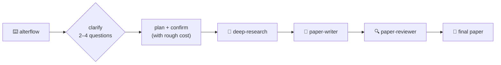

<div align="center">

<br>

<a href="skills/"></a>
<a href="skills/"></a>
<a href="docs/evals.md"></a>
<a href="https://www.anthropic.com"></a>
<a href="LICENSE"></a>
<a href="https://github.com/AlterLab-IEU/AlterLab-Academic-Skills/releases"></a>
<a href="https://agentskills.io"></a>

<br>

<a href="https://github.com/AlterLab-IEU/AlterLab-Academic-Skills/stargazers"></a>
<a href="https://github.com/AlterLab-IEU/AlterLab-Academic-Skills/network/members"></a>
<a href="https://github.com/AlterLab-IEU/AlterLab-Academic-Skills/issues"></a>
<a href="CONTRIBUTING.md"></a>
<a href="https://github.com/AlterLab-IEU/AlterLab-Academic-Skills/actions/workflows/pytest.yml"></a>
<a href="https://github.com/BehiSecc/awesome-claude-skills"></a>

<br>

> 📢 **Featured in** [awesome-claude-skills](https://github.com/BehiSecc/awesome-claude-skills) (5.7k ⭐)

<br>

**Read in:** [English](README.md) · [Türkçe](README.tr-TR.md)

<br><br>

<h3>🧬 239 purpose-built Claude AI skills for faculty, researchers & academicians</h3>
<p><em>Organized across 17 research domains — from Turkish academia to bioinformatics to digital humanities</em></p>
<p><em>239/239 ship executable evals · deterministic citation-existence verifier · per-domain bundles for claude.ai</em></p>

<p>🧭 <b>New in v2.6 — don't know which skill?</b> Just say <b>"use AlterLab skills"</b> and Claude picks it for you · type <b><code>alterflow</code></b> to launch a full multi-agent workflow</p>

<p>
<b>Research Pipeline</b> · <b>Scientific Databases</b> · <b>Bioinformatics</b> · <b>Data Science</b> · <b>Visualization</b> · <b>Clinical Research</b> · <b>and more</b>
</p>

<p>
<a href="skills/"><b>Explore Skills »</b></a> · 
<a href="#-quick-start">Quick Start</a> · 
<a href="#%EF%B8%8F-domain-overview">Domain Overview</a> · 
<a href="CONTRIBUTING.md">Contributing</a> · 
<a href="https://github.com/AlterLab-IEU/AlterLab-Academic-Skills/issues">Report Bug</a>
</p>

<br>

<hr>

<table><tr><td>
<b>Built by</b> <a href="https://github.com/AlterLab-IEU"><b>AlterLab Creative Technologies Laboratory</b></a>
<br><br>
<em>Not tied to any specific university — these skills work for any researcher, anywhere.</em>
</td></tr></table>

</div>

<br>

<!-- FEATURE HIGHLIGHTS -->

<div align="center">
<table>
<tr>
<td align="center" width="25%">
<h3>🎯</h3>
<h3>Plug & Play</h3>
<p>Drop a <code>.md</code> skill file into<br>Claude Projects or Claude Code<br>and get instant expertise</p>
</td>
<td align="center" width="25%">
<h3>🧠</h3>
<h3>Domain Expert</h3>
<p>Each skill transforms Claude<br>into a specialized research<br>assistant with deep knowledge</p>
</td>
<td align="center" width="25%">
<h3>🔬</h3>
<h3>Real Frameworks</h3>
<p>Built on actual scientific<br>methods, tools, and professional<br>output templates</p>
</td>
<td align="center" width="25%">
<h3>🌐</h3>
<h3>Universal</h3>
<p>Works for any researcher<br>at any institution —<br>no vendor lock-in</p>
</td>
</tr>
</table>
</div>

<br>

## ⚡ Try It — One Line, the Right Skill

**You don't need to know skill names.** Describe the task and `alterlab-skill-finder` (the front door) picks the skill for you — and tells you which one, and why.

**Route — one task → one skill:**

> 💬 *"Use AlterLab skills to review my methods section."*
> 🧭 → **`alterlab-paper-reviewer`** (methodology-focus)

> 💬 *"Which AlterLab skill finds and fact-checks papers on CRISPR off-target effects?"*
> 🧭 → **`alterlab-deep-research`** + **`alterlab-pubmed`**

**`alterflow` — a goal that spans stages → a clarified, multi-agent workflow:**

> 💬 *"**alterflow** — investigate the link between sleep and memory, and turn it into a publishable paper."*
> 🧭 → asks 2–4 scoping questions **first**, then plans and runs:



> Questions before execution — it never starts a 20-agent run blind, and simple tasks stay single-skill. Built on Anthropic's **routing** and **orchestrator-workers** patterns.

<br>

## 🚀 What's New in v2.6.0

- 🧭 **New front door — `alterlab-skill-finder`** — most users don't know 239 skill names by heart, so this router turns *"use AlterLab skills for this"* into the right skill(s). It classifies the task, maps it across all 17 domains, names the concrete skill(s) it picked (and why), and applies them — no name-memorization required. → [Core Pipeline](#-core-pipeline--10-skills)
- ⚡ **`alterflow` keyword → clarify-first multi-agent orchestration** — say **`alterflow`** (aliases `alterresearch` / `ultralab`) and the router first asks a few scoping questions, then **selects** the skills the goal needs and launches a **dynamic multi-agent workflow** composing them (via `alterlab-research-pipeline`, `alterlab-ssci-orchestrator`, or `alterlab-workflow-orchestration`). Questions before execution — it never starts blind.
- 🗂️ **Always-current skill index** — a generated [`skill_index.md`](skills/core/alterlab-skill-finder/references/skill_index.md) lists every skill grouped by domain with a one-line "use when"; a new CI test (`test_skill_index.py`) fails the build if a skill is added or renamed and the index is not regenerated (`scripts/gen_skill_index.py --check`).
- 📈 **239 skills across 17 domains**, 239 / 239 with executable evals; audit clean (0 errors, 0 warnings), full test suite green.

<details>
<summary><b>Previously — What's New in v2.5.0</b></summary>
<br>

- ⚖️ **Social-Science Workflow made even-handed (11 → 17 skills)** — the domain was quantitative-positivist by construction; v2.5 adds the qualitative and survey methods that were missing, plus depth. → [Social-Science Workflow](#-social-science-workflow--stage-gated-methods-spine-17-skills)
- 📊 **`alterlab-survey-analysis` (correctness gap)** — design-based inference for complex-sample surveys (GSS/ANES/ESS/DHS): declare weights/strata/PSU/FPC *before* estimating, Taylor + replicate-weight SEs, post-stratification/raking, design-adjusted GLMs. Analyzing weighted surveys unweighted is a real error (falsely narrow CIs); this fixes it. samplics/svy or R survey+srvyr.
- 🗣️ **`alterlab-qualitative-analysis` + `alterlab-ssci-reflexivity-gate` (balance fix)** — intercoder reliability done right (Krippendorff's α primary, + a stdlib bootstrap-CI calculator; chi-square/Cronbach/Pearson refused), branching to consensus-and-reflexivity for reflexive TA; and the qualitative analog of the measurement gate (positionality + Lincoln & Guba trustworthiness, fail-closed).
- 📈 **Quantitative depth** — `alterlab-multilevel-models` (mixed-effects with the under-reported reporting checklist), `alterlab-meta-analysis` (pooling, I²/τ², Egger/trim-and-fill, PRISMA), `alterlab-missing-data` (MCAR/MAR/MNAR + MICE with **Rubin's-rules pooling**; the sklearn single-imputation trap flagged).
- 🔬 **Every library web-verified & version-pinned** (samplics 0.6 / svy 0.18, krippendorff 0.8, statsmodels MixedLM, metafor 5.0, R mice 3.19, lme4 2.0). The orchestrator now paradigm-selects the measurement-stage gate (quant vs qual) and routes the new modules; `confusion_matrix.py` reports zero new gaps.
- 📈 **238 skills across 17 domains**, 238 / 238 with executable evals; audit clean (0 errors, 0 warnings), full test suite green.

</details>

<details>
<summary><b>Previously — What's New in v2.4.0</b></summary>
<br>

- 🧭 **New 17th domain — Social-Science Workflow** — a stage-gated **methods spine** of **11 skills**: an orchestrator, four discipline-enforcing validity gates a study passes through before it is analyzed or written — **design** (pin the identifying assumption before any causal claim), **measurement** (reliability is *not* validity — omega, not alpha alone), **sampling** (power / precision / saturation, never a rule of thumb), **inference** (the claim may not exceed its design, sample, or uncertainty) — and six pluggable analysis modules the orchestrator dispatches to.
- 🔬 **Six analysis modules, every library web-verified to its current API** — `alterlab-causal-inference` (DiD/IV/RDD/panel via statsmodels, linearmodels, pyfixest, DoWhy, EconML, rdrobust), `alterlab-sem-psychometrics` (semopy/factor_analyzer + a stdlib omega calculator), `alterlab-qca` (**shells to R's QCA package** — no maintained Python library exists), `alterlab-sna` (networkx/igraph + R ERGM), `alterlab-abm-mesa` (the **current Mesa 3 AgentSet API**, not the removed schedulers), and `alterlab-text-as-data` (BERTopic/LDA/embeddings). No invented flags; version pins in each SKILL.
- 🧪 **Executable, not just prose** — stdlib helpers (`design_router.py`, `sample_size.py`, `claim_audit.py`, `passport.py`, `estimator_router.py`, `omega.py`, `text_method_router.py`), loaded-on-demand references, and **vignette-in / routing-out evals** with near-miss negatives. `confusion_matrix.py` reports zero new routing gaps.
- 🔗 **Composes, does not duplicate** — the gates and modules *route to* the existing `alterlab-qualitative-methods`, `alterlab-survey-design`, `alterlab-statistical-analysis`, `alterlab-statsmodels`, `alterlab-networkx`, and `alterlab-test-selection-guard` skills rather than reimplementing them, threading a **Design Passport** from design → measurement → sampling → analysis → inference.
- 📈 **232 skills across 17 domains**, 232 / 232 with executable evals; audit clean (0 errors, 0 warnings), full test suite green.

</details>

<details>
<summary><b>Previously — What's New in v2.3.0</b></summary>
<br>

- 🛡️ **Trust manifest you can verify before installing** — a generated, CI-attested [`SECURITY_SCAN.md`](SECURITY_SCAN.md): the full outbound-host allowlist (66 domains, each categorized) plus an attestation of **no shell-pipe, no `eval`-on-input, no hardcoded secrets**. → [`SECURITY_SCAN.md`](SECURITY_SCAN.md)
- 🎯 **Activation + collision benchmarks** — `run_evals.py --activation` measures auto-selection rate against Anthropic's **90%** bar, and [`scripts/confusion_matrix.py`](scripts/confusion_matrix.py) statically ranks cross-firing risk between sibling skills. A **nightly rotating 1/7 behavioral shard** LLM-judges the whole corpus each week. → [`docs/evals.md`](docs/evals.md)
- 🧭 **Sharper routing** — **42 confusable descriptions** now carry explicit `prefer alterlab-x` routing (quantum, protein/structure DBs, cheminformatics toolkits, single-cell, pathology, plotting, RL).
- 🧩 **Agents & teams, formalized** — [`docs/agents-and-teams.md`](docs/agents-and-teams.md) names the **35 subagents** and the 4 teams they compose (Research, Writing, Reviewer Panel, Pipeline Orchestration).
- 🔌 **Portability map** — [`docs/portability.md`](docs/portability.md) states exactly what transfers to Codex / Cursor / Gemini vs. Claude-Code-specific, and `check_claudeai_compat.py` guards the claude.ai uploader whitelist.
- ✂️ **Every body under the soft cap** — the last **17** over-500-line skills split into `references/`; the body-length ratchet is now empty. Coverage holds at **210 / 210**. → [`docs/evals.md`](docs/evals.md)

</details>

<details>
<summary><b>Previously — What's New in v2.2.0</b></summary>
<br>

- 🧠 **Research-backed elevation of 191 skills** — a corpus-wide accuracy and depth pass over every pre-existing skill: corrected regulation/API details, slimmed oversized bodies into `references/`, and version-bumped touched skills.
- 🧩 **New core skill: Workflow Orchestration** (`alterlab-workflow-orchestration`) — composes AlterLab skills into multi-agent workflows (subagent fan-out, pipelines, judge panels, adversarial verification), lifting the corpus to **210 skills**. → [Core Pipeline](#-core-pipeline--10-skills)
- 🇹🇷 **Turkish-academia flagship (12 skills)** — the deepest Turkish-academia suite in any skills library: DergiPark, TR Dizin, YÖK Tez, YÖK Akademik, YÖKATLAS, TÜBİTAK 1001/1002-A proposals, doçentlik eligibility, akademik teşvik scoring, Turkish APA-7 style, TR research ethics, KVKK data-management plans, and TÜBİTAK Aperta — each wired to a verified national-platform endpoint. → [Turkish Academia](#-turkish-academia--national-platforms--scholarly-workflow-12-skills)
- 🎓 **Faculty Life (6 skills)** — syllabus AI policy, post-award grant reporting, recommendation letters, AACSB/ABET accreditation (AoL), REDCap/CDISC capture, and preprint deposition. → [Faculty Life](#-faculty-life--teaching-service--the-academic-career-6-skills)
- 🧪 **Methodology (3 skills)** — superpowers-style rigor (Iron Laws, Excuse-vs-Reality tables) applied to research methods: pre-registration discipline, statistical-test-selection guard, and results-reporting transparency. → [Methodology](#-methodology--research-rigor--discipline-gates-3-skills)
- 🧬 **Bioinformatics grew 25 → 30** — production pipelines: nf-core/sarek variant calling, QIIME 2 amplicon, salmon/kallisto RNA-seq quant, NCBI BLAST+, and Squidpy spatial transcriptomics. → [Bioinformatics](#-bioinformatics--genomics-proteomics--molecular-biology-30-skills)

</details>

<details>
<summary><b>Previously — What's New in v2.0</b></summary>
<br>

- ✅ **Full-corpus executable evals** — schema + trigger-coverage are CI-gated on every PR; the behavioral pass (claude CLI + LLM judge) runs on demand via `workflow_dispatch`. → [`docs/evals.md`](docs/evals.md)
- 🔎 **Deterministic citation-existence verifier** that catches hallucinated references against Crossref / OpenAlex / Semantic Scholar / arXiv — no LLM guesswork in the gate. → [Headline feature](#-headline-feature--alterlab-citation-verifier)
- 📦 **Per-domain `claude.ai` bundles on every Release** — each `dist/<domain>.zip` clears the 200-file / 30 MB caps. → [Releases](https://github.com/AlterLab-IEU/AlterLab-Academic-Skills/releases)
- 🌐 **Live searchable catalog** to browse every skill in the browser. → [Browse the Catalog](#-browse-the-catalog)
- 🤖 **35 registered subagents + slash commands + a bundled academic MCP** wiring PubMed / OpenAlex / Crossref / Zotero. → [MCP & Slash Commands](#-mcp--slash-commands)
- 📜 **Honest provenance** — upstream K-Dense fork credited in [`THIRD_PARTY_NOTICES.md`](THIRD_PARTY_NOTICES.md) and a machine-readable [`CITATION.cff`](CITATION.cff). → [Cite This Repository](#-cite-this-repository)

</details>

<br>

## 📋 Table of Contents

<details open>
<summary><b>Click to expand / collapse</b></summary>
<br>

- [⚡ Try It — One Line, the Right Skill](#-try-it--one-line-the-right-skill)
- [🚀 What's New in v2.6.0](#-whats-new-in-v260)
- [🎯 What Is This?](#-what-is-this)
- [🆕 v2.0 Highlights](#-v20-highlights)
- [✨ Key Features](#-key-features)
- [🗂️ Domain Overview](#%EF%B8%8F-domain-overview)
- [🔎 Browse the Catalog](#-browse-the-catalog)
- [🚀 Quick Start](#-quick-start)
- [⚡ Core Pipeline — 10 Skills](#-core-pipeline--10-skills)
- [📚 All 239 Skills](#-all-239-skills)
- [🏗️ Project Structure](#%EF%B8%8F-project-structure)
- [⚙️ How Skills Work](#%EF%B8%8F-how-skills-work)
- [💡 Usage Examples](#-usage-examples)
- [⚖️ How It Compares](#%EF%B8%8F-how-it-compares)
- [🤝 Contributing](#-contributing)
- [📖 Cite This Repository](#-cite-this-repository)
- [📜 License](#-license)
- [🙏 Credits](#-credits)

</details>

<br>

## 🎯 What Is This?

A comprehensive suite of **239 purpose-built Claude AI skills** for faculty members, academicians, and researchers — organized into **17 domain categories** spanning the full academic research lifecycle.

Each skill transforms Claude into a **domain-specific expert assistant** tailored to academic research, scientific computing, and scholarly publishing workflows.

> [!TIP]
> **How it works:** Each skill is a structured `SKILL.md` file. Install the collection as a Claude Code plugin, or copy a skill directory into `~/.claude/skills/` (or a project's `.claude/skills/`) — and Claude becomes your research expert, with real scientific frameworks, professional output templates, and deep domain knowledge. A loose `.md` file does **not** auto-load.

<br>

## 🆕 v2.0 Highlights

> *v2.0 is the "Trust & Reach" release — it turns the loudest objection to academic skills ("just prompts, no evals") into the headline differentiator.*

| | What | Detail |
|:---:|:---|:---|
| ✅ | **Executable evals across the corpus** | **239 / 239** skills ship `evals/evals.json` on the canonical [agentskills.io](https://agentskills.io) schema, validated in CI. See [`docs/evals.md`](docs/evals.md). |
| 🔎 | **Citation-existence verifier** | New core skill `alterlab-citation-verifier` — a **deterministic** gate that checks every reference actually exists against four keyless scholarly APIs (Crossref, OpenAlex, Semantic Scholar, arXiv), flags retractions, and maps claim-faithfulness verdicts. See below. |
| 📦 | **Per-domain bundles for claude.ai** | `dist/<domain>.zip` bundles (one per domain) attached to each [Release](https://github.com/AlterLab-IEU/AlterLab-Academic-Skills/releases) — each clears claude.ai's 200-file / 30 MB caps and vendors the shared handoff contracts. |
| 🔌 | **Bundled academic MCP** | The `core` and `databases` plugins ship a `.mcp.json` wiring PubMed / OpenAlex / Crossref / Zotero, with a documented `requests/` fallback when no MCP is available. |
| ⌨️ | **Slash commands** | `/lit-review`, `/review-paper`, `/cite-check`, `/research-pipeline` — drive the core pipeline directly. |
| 🗂️ | **Generated catalog** | A machine-readable [`skills.json`](skills.json) is generated from skill frontmatter; a CI gate keeps every count in this README honest. |
| 📜 | **Honest provenance** | Upstream K-Dense fork credited in [`THIRD_PARTY_NOTICES.md`](THIRD_PARTY_NOTICES.md) + [`PROVENANCE.md`](PROVENANCE.md) / [`CITATION.cff`](CITATION.cff). |

### 🔎 Headline feature — `alterlab-citation-verifier`

Around **147 k** hallucinated citations surfaced in published work in 2025. Prompt-only "fact-checking" misses roughly a third of them. `alterlab-citation-verifier` is a **deterministic** core capability that, for every entry in a bibliography:

- cross-checks existence against **Crossref + OpenAlex + Semantic Scholar + arXiv** (all keyless),
- resolves DOIs / arXiv IDs and matches title + author with a Levenshtein threshold,
- flags **Retraction Watch** entries,
- maps each verdict to the suite's TF / PAC / IH / PH / SH faithfulness taxonomy,

and degrades gracefully to plain `requests` / WebSearch when no MCP or network is present. It rewires the pipeline's bibliography and integrity agents to call it instead of generic web search.

<br>

### 🧭 Headline feature — `alterlab-skill-finder` (the front door)

No one memorizes **239** skill names. `alterlab-skill-finder` is the **front door**: say *"use AlterLab skills for this"* and it classifies your task, maps it across all **17 domains**, and applies the right skill(s) — telling you which it picked and why. For a goal that spans stages, the **`alterflow`** keyword turns it into a **launcher**:

- **CLARIFY** — asks 2–4 scoping questions *before* doing anything,
- **SELECT & PLAN** — picks the skills the goal needs and lays out a dynamic multi-agent workflow, scaling the agent count to complexity,
- **CONFIRM** — shows the plan *and its rough cost*, then executes,
- **COMPOSE** — reuses the existing orchestrators (`alterlab-research-pipeline`, `alterlab-ssci-orchestrator`, `alterlab-workflow-orchestration`) rather than reinventing them.

Built on Anthropic's documented **routing** and **orchestrator-workers** patterns — questions before execution, simplest path by default.

<br>

## ✨ Key Features

| | Feature | Description |
|:---:|:---|:---|
| 🧭 | **One-Command Front Door** | Just say *"use AlterLab skills"* — `alterlab-skill-finder` picks the right skill(s) for you; the **`alterflow`** keyword clarifies your goal, then launches a multi-agent workflow |
| 🔬 | **Research-Ready** | Skills built on real scientific methods, databases, and professional frameworks used by working researchers |
| 🤖 | **Multi-Agent Pipelines** | Core skills chain together: Research → Write → Review → Publish in a seamless workflow |
| 📊 | **39 Database Integration Skills** | Instant access to PubMed, ChEMBL, UniProt, ClinicalTrials.gov, COSMIC, and more |
| 🧬 | **Deep Domain Coverage** | From single-cell RNA-seq analysis to quantum computing, from clinical trials to digital humanities |
| 📝 | **Publication-Quality Output** | LaTeX papers, conference posters, grant proposals, scientific visualizations — all formatted to professional standards |
| 🔄 | **Mix & Match** | Combine multiple skills in one Claude Project for a multi-expert research team |

<br>

## 🗂️ Domain Overview

| | Domain | Skills | Focus Areas |
|:---:|:---|:---:|:---|
| 🔄 | **Core Pipeline** | **10** | Multi-agent research → write → review → publish pipeline + citation verifier + teaching + thesis + workflow orchestration + skill-finder router (the `alterflow` launcher) |
| 🗄️ | **Databases** | **39** | Connectors to scientific databases — PubMed, ChEMBL, UniProt, ClinicalTrials.gov, COSMIC, and more |
| 🧬 | **Bioinformatics** | **30** | Genomics, proteomics, molecular biology — Scanpy, BioPython, ESM, single-cell analysis, nf-core/sarek, QIIME 2, RNA-seq quant |
| ⚗️ | **Cheminformatics** | **12** | Chemistry and drug discovery — RDKit, molecular dynamics, docking, ADMET |
| 🏥 | **Clinical Research** | **7** | Clinical decision support, treatment planning, medical imaging, regulatory |
| 📊 | **Data Science** | **22** | ML/statistics — scikit-learn, PyTorch Lightning, SHAP, transformers |
| 📈 | **Visualization** | **8** | Scientific plotting — Matplotlib, Seaborn, Plotly, schematics, infographics |
| ✍️ | **Writing Tools** | **13** | Scientific writing, citations, grants, posters, academic career |
| 🔧 | **Lab Integrations** | **9** | Laboratory platforms — Benchling, DNAnexus, Opentrons, Protocols.io |
| 🌍 | **Domain-Specific** | **17** | Quantum computing, geospatial, materials science, social science methods, digital humanities |
| 📄 | **Document Tools** | **2** | Markdown & document conversion — MarkItDown, Open Notebook |
| 🔍 | **Research Tools** | **14** | Search, discovery, Zotero, citation graphs, PDF evidence tables, qualitative methods, ethics, surveys, open science |
| 💰 | **Finance & Economics** | **7** | FRED, Alpha Vantage, SEC EDGAR, market research |
| 🇹🇷 | **Turkish Academia** | **12** | National platforms & scholarly workflow — DergiPark, TR Dizin, YÖK Tez/Akademik, YÖKATLAS, TÜBİTAK proposals, doçentlik, teşvik, KVKK, Aperta |
| 🎓 | **Faculty Life** | **6** | Teaching, service & the academic career — syllabus AI policy, grant reporting, recommendation letters, accreditation, REDCap/CDISC, preprints |
| 🧪 | **Methodology** | **3** | Research-rigor discipline gates — pre-registration, test-selection guard, results-reporting transparency |
| 🧭 | **Social-Science Workflow** | **17** | Stage-gated methods spine — orchestrator + 5 validity gates (design, measurement, sampling, reflexivity, inference) + 11 analysis modules (causal-inference, SEM/psychometrics, QCA, SNA, ABM, text-as-data, survey-analysis, qualitative-analysis, multilevel-models, meta-analysis, missing-data) |
<br>

## 🔎 Browse the Catalog

<div align="center">

<a href="https://alterlab-ieu.github.io/AlterLab-Academic-Skills/"></a>

<em>Search all 239 skills by name, domain, or keyword — no install required.</em>

</div>

<br>

## 🚀 Quick Start

### 🎓 New here / not technical? Start in the **Claude app** — no terminal, no git

Skills work in **claude.ai (browser)** and the **Claude desktop app** with a plain upload — no command line:

1. In Claude, make sure **code execution** is on: **Settings → Capabilities** *(Team/Enterprise: an owner enables it once for the org)*.
2. Open **Customize ▸ Skills** → **[claude.ai/customize/skills](https://claude.ai/customize/skills)**.
3. Click **`+`** → **Create skill** → **Upload a skill**, and choose a skill's **`.zip`**.
4. Flip the skill's toggle **On**. Now just chat normally — Claude uses the skill automatically when your request matches it.

**Where do I get the `.zip`? Two no-terminal ways:**

- **One skill** — click the green **`< > Code` ▸ Download ZIP** button at the top of this repo, unzip it, then right-click the skill folder you want (e.g. `skills/bioinformatics/alterlab-scanpy`) and **Compress / Zip** it. Upload *that* zip.
- **A whole domain at once** — download a ready-made bundle (e.g. `bioinformatics.zip`) from the **[Releases page](https://github.com/AlterLab-IEU/AlterLab-Academic-Skills/releases)**.

> [!IMPORTANT]
> A loose `.md` file dragged into a chat is **not** an installed skill — it must be a **zip of the skill folder** (with its `SKILL.md` inside). Only install skills from sources you trust, and note that skills you upload in the app are tied to your account and don't sync to Claude Code.

<br>

*Comfortable with a terminal or Claude Code? Pick one of the options below instead.*

### 🌍 Option 1 — Agent Skills (open standard) *(Recommended)*

```bash
npx skills add AlterLab-IEU/AlterLab-Academic-Skills
```

These are portable **Agent Skills** following the [agentskills.io](https://agentskills.io) open standard — they also work in **Cursor, Codex, Gemini CLI, and Copilot**, not Claude only.

> [!NOTE]
> **Standard: Agent Skills.** This collection conforms to the open Agent Skills standard. See [agentskills.io](https://agentskills.io) for the spec and the list of supporting agents.

### ⚡ Option 2 — Claude Code Plugin

Add the marketplace once, then install only the domains you need:

```bash
/plugin marketplace add AlterLab-IEU/AlterLab-Academic-Skills
# No SSH key? Use the HTTPS marketplace path instead:
/plugin marketplace add https://github.com/AlterLab-IEU/AlterLab-Academic-Skills.git
/plugin install alterlab-bioinformatics@alterlab-academic-skills
/reload-plugins
```

Each domain is its **own installable plugin** — install only what you need. For example, the full
social-science methods spine (17 skills: orchestrator + 5 validity gates + 11 analysis modules):

```bash
/plugin marketplace add AlterLab-IEU/AlterLab-Academic-Skills
/plugin install alterlab-social-science-workflow@alterlab-academic-skills
/reload-plugins
```

For local development against a clone, point Claude Code at the directory directly:

```bash
claude --plugin-dir /path/to/AlterLab-Academic-Skills
```

Available domain plugins (17): `alterlab-core`, `alterlab-databases`, `alterlab-bioinformatics`, `alterlab-cheminformatics`, `alterlab-clinical-research`, `alterlab-data-science`, `alterlab-visualization`, `alterlab-writing-tools`, `alterlab-lab-integrations`, `alterlab-domain-specific`, `alterlab-document-tools`, `alterlab-research-tools`, `alterlab-finance-economics`, `alterlab-turkish-academia`, `alterlab-faculty-life`, `alterlab-methodology`, `alterlab-social-science-workflow`.

### 📁 Option 3 — Personal or Project Install (manual)

```bash
git clone https://github.com/AlterLab-IEU/AlterLab-Academic-Skills.git
# Personal — available in every project:
cp -R AlterLab-Academic-Skills/skills/bioinformatics/alterlab-scanpy ~/.claude/skills/
# Project-scoped — only in the current repo:
cp -R AlterLab-Academic-Skills/skills/bioinformatics/alterlab-scanpy .claude/skills/
```

Then restart Claude Code. A skill must live at `~/.claude/skills/<name>/SKILL.md` or `.claude/skills/<name>/SKILL.md` — a bare `git clone` alone does **not** register anything.

### 🌐 Option 4 — Claude.ai (per-domain bundles)

Every Release ships pre-built **`dist/<domain>.zip`** bundles. Each is spec-conformant and clears claude.ai's 200-file / 30 MB caps, and vendors the shared handoff contracts so cross-skill references resolve.

1. Download the domain bundle you need from the [Releases page](https://github.com/AlterLab-IEU/AlterLab-Academic-Skills/releases) — e.g. `bioinformatics.zip`, `databases.zip`, `core.zip`.
2. In Claude, open **Customize ▸ Skills** ([claude.ai/customize/skills](https://claude.ai/customize/skills)) → **`+`** → **Create skill** → **Upload a skill**, then pick the zip (requires **code execution** enabled under **Settings → Capabilities**). See the [no-terminal walkthrough](#-new-here--not-technical-start-in-the-claude-app--no-terminal-no-git) above.

Skills do not sync between claude.ai and Claude Code. To zip a single skill yourself instead, archive its directory (`zip -r alterlab-scanpy.zip skills/bioinformatics/alterlab-scanpy`).

### 🛠️ Option 5 — `install.sh` (scriptable local install)

The bundled installer copies whole domains and/or individual skills into the right local directory (`~/.claude/skills/` or the cross-tool `~/.agents/skills/`), idempotently:

```bash
git clone https://github.com/AlterLab-IEU/AlterLab-Academic-Skills.git
cd AlterLab-Academic-Skills

scripts/install.sh --list                         # show every domain / skill
scripts/install.sh bioinformatics                 # whole domain
scripts/install.sh databases/alterlab-pubmed      # one skill
scripts/install.sh --project core                 # into ./.claude/skills
scripts/install.sh                                 # install everything
```

Then restart your agent to load them.

### 🔌 MCP & Slash Commands

The `core` and `databases` plugins ship a `.mcp.json` that wires the **PubMed / OpenAlex / Crossref / Zotero** academic MCP servers, with a documented `requests/` fallback when no MCP host is available — so the citation verifier and database skills work online or offline. Install either plugin (Option 2) to pick the MCP up automatically.

Installing the `core` plugin also registers these slash commands:

| Command | Drives |
|:---|:---|
| `/lit-review` | `alterlab-deep-research` — systematic literature review |
| `/review-paper` | `alterlab-paper-reviewer` — multi-perspective peer review |
| `/cite-check` | `alterlab-citation-verifier` — deterministic citation-existence gate |
| `/research-pipeline` | `alterlab-research-pipeline` — full research → publish orchestrator |

<br>

> [!NOTE]
> **239 / 239 skills ship executable evals** on the canonical [agentskills.io](https://agentskills.io) schema. Schema and trigger-coverage are validated in CI on every PR; the behavioral pass (claude CLI + LLM judge) runs on demand via `workflow_dispatch` **and nightly over a rotating 1/7 shard**, so the whole corpus is behaviorally judged across each week. An [`--activation`](docs/evals.md) harness additionally measures auto-selection rate against Anthropic's 90% bar, and [`scripts/confusion_matrix.py`](scripts/confusion_matrix.py) statically ranks cross-firing risk between sibling skills. See [`docs/evals.md`](docs/evals.md).
>
> **Trust & portability signals** (all generated + CI-enforced): [`SECURITY_SCAN.md`](SECURITY_SCAN.md) — outbound-host allowlist + a no-shell-pipe / no-`eval`-on-input / no-hardcoded-secrets attestation; [`docs/portability.md`](docs/portability.md) — what transfers to Codex/Cursor/Gemini vs. Claude-Code-specific; [`docs/agents-and-teams.md`](docs/agents-and-teams.md) — the 35 pipeline subagents and the teams they compose.

<br>

---

## ⚡ Core Pipeline — 10 Skills

> *The heart of the system — a multi-agent research-to-publication pipeline with 35 specialized agents, plus teaching and thesis supervision tools.*

| # | Skill | Agents | What It Does |
|:---:|:---|:---:|:---|
| 1 | **🔬 Deep Research** | 13 | Multi-mode research with systematic review, Socratic dialogue, fact-checking |
| 2 | **📝 Paper Writer** | 12 | Academic paper authoring with LaTeX, bilingual support, 9 writing modes |
| 3 | **🔍 Paper Reviewer** | 7 | Multi-perspective peer review with Devil's Advocate, 0–100 quality rubrics |
| 4 | **🔄 Research Pipeline** | 3 | 10-stage orchestrator with integrity verification and material passports |
| 5 | **🔎 Citation Verifier** | — | Deterministic citation-existence gate over Crossref / OpenAlex / Semantic Scholar / arXiv |
| 6 | **🎓 Teaching Design** | — | Course design, syllabi, rubrics, Bloom's taxonomy, backward design |
| 7 | **📋 Thesis Supervisor** | — | Dissertation guidance, defense prep, committee management |
| 8 | **🔗 Link Health** | — | Repo link-health audit meta-skill |
| 9 | **🧩 Workflow Orchestration** | — | Composes AlterLab skills into multi-agent workflows: subagent fan-out, pipelines, judge panels, adversarial verification |
| 10 | **🧭 Skill Finder** | — | Front-door router — turns *"use AlterLab skills"* into the right skill(s); the **`alterflow`** keyword clarifies the goal then launches a dynamic multi-agent workflow |

<br>

---

## 📚 All 239 Skills

### 🗄️ Databases — Scientific Database Connectors (39 Skills)

<details>
<summary><b>Click to expand full database skills list</b></summary>
<br>

| # | Skill | What It Does |
|:---:|:---|:---|
| 1 | **AlphaFold DB** | Protein structure predictions from AlphaFold |
| 2 | **arXiv** | Preprint search and discovery |
| 3 | **BindingDB** | Binding affinity data for drug-target interactions |
| 4 | **bioRxiv** | Biology preprint search and monitoring |
| 5 | **BRENDA** | Enzyme functional data |
| 6 | **cBioPortal** | Cancer genomics data exploration |
| 7 | **ChEMBL** | Bioactive molecules with drug-like properties |
| 8 | **ClinicalTrials.gov** | Clinical trial registry search |
| 9 | **ClinPGx** | Clinical pharmacogenomics data |
| 10 | **ClinVar** | Genomic variation and human health |
| 11 | **COSMIC** | Catalogue of somatic mutations in cancer |
| 12 | **Data Commons** | Google's open knowledge graph |
| 13 | **DepMap** | Cancer dependency mapping |
| 14 | **DrugBank** | Drug and drug target information |
| 15 | **ENA** | European Nucleotide Archive |
| 16 | **Ensembl** | Genome annotation and variation |
| 17 | **FDA** | FDA drug and device data |
| 18 | **Gene DB** | Gene-level data aggregation |
| 19 | **GEO** | Gene Expression Omnibus datasets |
| 20 | **gnomAD** | Genome aggregation and variant frequency |
| 21 | **GTEx** | Tissue-specific gene expression |
| 22 | **GWAS Catalog** | Genome-wide association studies |
| 23 | **HMDB** | Human Metabolome Database |
| 24 | **Imaging Data Commons** | Cancer imaging data |
| 25 | **InterPro** | Protein families and domains |
| 26 | **JASPAR** | Transcription factor binding profiles |
| 27 | **KEGG** | Biological pathways and networks |
| 28 | **Metabolomics Workbench** | Metabolomics data repository |
| 29 | **Monarch Initiative** | Disease-gene associations |
| 30 | **OpenAlex** | Open scholarly metadata |
| 31 | **Open Targets** | Drug target identification |
| 32 | **PDB** | Protein 3D structure database |
| 33 | **PubChem** | Chemical information database |
| 34 | **PubMed** | Biomedical literature search |
| 35 | **Reactome** | Biological pathway database |
| 36 | **STRING** | Protein-protein interaction networks |
| 37 | **UniProt** | Protein sequence and function |
| 38 | **USPTO** | Patent search and analysis |
| 39 | **ZINC** | Commercially-available compounds for docking |

</details>

### 🧬 Bioinformatics — Genomics, Proteomics & Molecular Biology (30 Skills)

<details>
<summary><b>Click to expand full bioinformatics skills list</b></summary>
<br>

| # | Skill | What It Does |
|:---:|:---|:---|
| 1 | **AnnData** | Annotated data matrices for single-cell |
| 2 | **Arboreto** | Gene regulatory network inference |
| 3 | **BioPython** | General-purpose bioinformatics toolkit |
| 4 | **BioServices** | Programmatic access to biological web services |
| 5 | **CellxGene** | Interactive single-cell data exploration |
| 6 | **COBRApy** | Constraint-based metabolic modeling |
| 7 | **deepTools** | NGS data analysis and visualization |
| 8 | **ESM** | Protein language models |
| 9 | **ETE Toolkit** | Phylogenetic tree analysis and visualization |
| 10 | **FlowIO** | Flow cytometry data handling |
| 11 | **gget** | Query genomic databases from Python |
| 12 | **Glycoengineering** | Glycan analysis and engineering |
| 13 | **HistoLab** | Computational histopathology |
| 14 | **LaminDB** | Data lineage and biological data management |
| 15 | **Neuropixels** | Neural probe data processing |
| 16 | **PathML** | Machine learning for pathology |
| 17 | **Phylogenetics** | Evolutionary tree construction |
| 18 | **PyDESeq2** | Differential gene expression analysis |
| 19 | **pyOpenMS** | Mass spectrometry data analysis |
| 20 | **pysam** | SAM/BAM file manipulation |
| 21 | **Scanpy** | Single-cell analysis in Python |
| 22 | **scikit-bio** | Bioinformatics algorithms and data structures |
| 23 | **scVelo** | RNA velocity analysis |
| 24 | **scvi-tools** | Deep generative models for single-cell |
| 25 | **TileDB-VCF** | Population-scale genomic variant storage |
| 26 | **BLAST** | NCBI BLAST+ command-line sequence similarity searches |
| 27 | **nf-core/sarek** | FASTQ-to-VCF germline & somatic variant-calling pipeline |
| 28 | **QIIME 2 Amplicon** | 16S/ITS microbiome amplicon analysis |
| 29 | **RNA-seq Quant** | Transcript abundance with salmon & kallisto |
| 30 | **Squidpy Spatial** | Spatial transcriptomics on AnnData/SpatialData |

</details>

### ⚗️ Cheminformatics — Chemistry & Drug Discovery (12 Skills)

<details>
<summary><b>Click to expand full cheminformatics skills list</b></summary>
<br>

| # | Skill | What It Does |
|:---:|:---|:---|
| 1 | **Datamol** | Molecular data manipulation |
| 2 | **DeepChem** | Deep learning for chemistry |
| 3 | **DiffDock** | Diffusion-based molecular docking |
| 4 | **matchms** | Mass spectra matching and similarity |
| 5 | **MedChem** | Medicinal chemistry analysis |
| 6 | **Molecular Dynamics** | MD simulation setup and analysis |
| 7 | **MolFeat** | Molecular featurization |
| 8 | **PrimeKG** | Precision medicine knowledge graph |
| 9 | **PyTDC** | Therapeutics Data Commons access |
| 10 | **RDKit** | Core cheminformatics toolkit |
| 11 | **Rowan** | Computational chemistry workflows |
| 12 | **TorchDrug** | Graph neural networks for drug discovery |

</details>

### 🏥 Clinical Research — Clinical Decision Support & Medical Tools (7 Skills)

<details>
<summary><b>Click to expand full clinical research skills list</b></summary>
<br>

| # | Skill | What It Does |
|:---:|:---|:---|
| 1 | **Clinical Decision** | Evidence-based clinical decision support |
| 2 | **Clinical Reports** | Structured clinical report generation |
| 3 | **ISO 13485** | Medical device quality management |
| 4 | **NeuroKit2** | Neurophysiological signal processing |
| 5 | **PyDicom** | DICOM medical image handling |
| 6 | **PyHealth** | Healthcare ML pipelines |
| 7 | **Treatment Plans** | Treatment planning and protocol design |

</details>

### 📊 Data Science — ML, Statistics & Data Analysis (22 Skills)

<details>
<summary><b>Click to expand full data science skills list</b></summary>
<br>

| # | Skill | What It Does |
|:---:|:---|:---|
| 1 | **Dask** | Parallel computing and out-of-core data |
| 2 | **EDA** | Exploratory data analysis |
| 3 | **NetworkX** | Network/graph analysis |
| 4 | **Polars** | High-performance DataFrames |
| 5 | **PufferLib** | Reinforcement learning environments |
| 6 | **PyMC** | Bayesian statistical modeling |
| 7 | **pymoo** | Multi-objective optimization |
| 8 | **PyTorch Lightning** | Structured deep learning training |
| 9 | **scikit-learn** | Classical machine learning |
| 10 | **scikit-survival** | Survival analysis |
| 11 | **SHAP** | Model interpretability and feature importance |
| 12 | **SimPy** | Discrete-event simulation |
| 13 | **Stable-Baselines3** | Reinforcement learning algorithms |
| 14 | **Statistical Analysis** | Classical statistical tests and methods |
| 15 | **statsmodels** | Statistical models and econometrics |
| 16 | **SymPy** | Symbolic mathematics |
| 17 | **TimesFM** | Foundation model for time series |
| 18 | **PyTorch Geometric** | Graph neural networks |
| 19 | **Transformers** | Hugging Face transformer models |
| 20 | **UMAP** | Dimensionality reduction |
| 21 | **Vaex** | Out-of-core DataFrames for big data |
| 22 | **Zarr** | Chunked, compressed N-dimensional arrays |

</details>

### 📈 Visualization — Scientific Plotting & Graphics (8 Skills)

<details>
<summary><b>Click to expand full visualization skills list</b></summary>
<br>

| # | Skill | What It Does |
|:---:|:---|:---|
| 1 | **Generate Image** | AI image generation for research figures |
| 2 | **Infographics** | Research infographic design |
| 3 | **Matplotlib** | Publication-quality 2D plots |
| 4 | **Mermaid** | Diagrams and flowcharts as code |
| 5 | **Plotly** | Interactive scientific visualizations |
| 6 | **Scientific Schematics** | Technical diagrams and schematics |
| 7 | **Scientific Viz** | Advanced scientific visualization |
| 8 | **Seaborn** | Statistical data visualization |

</details>

### ✍️ Writing Tools — Scientific Writing, Citations & Publishing (13 Skills)

<details>
<summary><b>Click to expand full writing tools skills list</b></summary>
<br>

| # | Skill | What It Does |
|:---:|:---|:---|
| 1 | **Academic Career** | Academic CV, research statements, tenure dossier |
| 2 | **Citation Management** | Reference formatting and management |
| 3 | **Hypothesis Generator** | Research hypothesis development |
| 4 | **LaTeX Posters** | Conference poster design in LaTeX |
| 5 | **Literature Review** | Systematic literature review assistance |
| 6 | **Paper-to-Web** | Convert papers to web-friendly formats |
| 7 | **Peer Review** | Peer review writing assistance |
| 8 | **PPTX Posters** | Conference posters in PowerPoint |
| 9 | **Research Grants** | Grant proposal writing |
| 10 | **Scholar Eval** | Academic output evaluation |
| 11 | **Scientific Slides** | Research presentation creation |
| 12 | **Scientific Writing** | Academic writing style and structure |
| 13 | **Venue Templates** | Journal/conference formatting templates |

</details>

### 🔧 Lab Integrations — Laboratory Platform Connectors (9 Skills)

<details>
<summary><b>Click to expand full lab integration skills list</b></summary>
<br>

| # | Skill | What It Does |
|:---:|:---|:---|
| 1 | **Benchling** | Molecular biology data platform |
| 2 | **DNAnexus** | Genomic data analysis platform |
| 3 | **Ginkgo Cloud** | Synthetic biology platform |
| 4 | **LabArchive** | Electronic lab notebook |
| 5 | **LatchBio** | Bioinformatics workflow platform |
| 6 | **OMERO** | Biological image management |
| 7 | **Opentrons** | Lab automation and robotics |
| 8 | **Protocols.io** | Protocol sharing and management |
| 9 | **PyLabRobot** | Lab robotics programming |

</details>

### 🌍 Domain-Specific — Quantum, Geospatial, Materials, Social Science & More (17 Skills)

<details>
<summary><b>Click to expand full domain-specific skills list</b></summary>
<br>

| # | Skill | What It Does |
|:---:|:---|:---|
| 1 | **Adaptyv** | Adaptive experimental design |
| 2 | **Aeon** | Time series classification |
| 3 | **AstroPy** | Astronomy and astrophysics |
| 4 | **Cirq** | Quantum circuit design (Google) |
| 5 | **FluidSim** | Fluid dynamics simulation |
| 6 | **GeniML** | Genomic interval ML |
| 7 | **GeoMaster** | Geospatial analysis mastery |
| 8 | **GeoPandas** | Geospatial data analysis |
| 9 | **GTARS** | Genomic tool for annotation |
| 10 | **HypoGenic** | Hypothesis generation from data |
| 11 | **Modal** | Cloud compute for research |
| 12 | **PennyLane** | Quantum machine learning |
| 13 | **Pymatgen** | Materials science analysis |
| 14 | **Qiskit** | Quantum computing (IBM) |
| 15 | **QuTiP** | Quantum dynamics simulation |
| 16 | **Social Science Methods** | Discourse analysis, QCA, Delphi, process tracing |
| 17 | **Digital Humanities** | Text mining, corpus linguistics, stylometry, OCR |

</details>

### 📄 Document Tools — Markdown & Document Conversion (2 Skills)

<details>
<summary><b>Click to expand full document tools skills list</b></summary>
<br>

| # | Skill | What It Does |
|:---:|:---|:---|
| 1 | **MarkItDown** | Convert documents to Markdown |
| 2 | **Open Notebook** | Open-format research notebooks |

</details>

### 🔍 Research Tools — Search, Discovery, Methods & Reference Management (14 Skills)

<details>
<summary><b>Click to expand full research tools skills list</b></summary>
<br>

| # | Skill | What It Does |
|:---:|:---|:---|
| 1 | **BGPT Search** | AI-powered research search |
| 2 | **Citation Graph** | Keyless ResearchRabbit analog — citation & co-citation graphs over OpenAlex |
| 3 | **Mixed Methods** | Mixed-methods research design and integration |
| 4 | **Open Science** | Preregistration, FAIR data, open access publishing |
| 5 | **Parallel Web** | Multi-source parallel web search |
| 6 | **PDF Extract** | Elicit-columns analog — per-paper evidence tables from PDFs |
| 7 | **Perplexity** | Perplexity-powered research queries |
| 8 | **PyZotero** | Zotero reference manager integration |
| 9 | **Qualitative Methods** | Thematic analysis, grounded theory, IPA, coding |
| 10 | **Research Ethics** | IRB applications, informed consent, GDPR |
| 11 | **Research Lookup** | Quick research paper discovery |
| 12 | **Scientific Brainstorm** | Structured research ideation |
| 13 | **Scientific Thinking** | Critical scientific reasoning frameworks |
| 14 | **Survey Design** | Questionnaire construction and validation |

</details>

### 💰 Finance & Economics — Financial Data & Analysis (7 Skills)

<details>
<summary><b>Click to expand full finance & economics skills list</b></summary>
<br>

| # | Skill | What It Does |
|:---:|:---|:---|
| 1 | **Alpha Vantage** | Stock and financial market data |
| 2 | **Denario** | Financial data processing |
| 3 | **EDGAR Tools** | SEC filing search and analysis |
| 4 | **FRED** | Federal Reserve economic data |
| 5 | **Hedge Fund Monitor** | Hedge fund tracking and analysis |
| 6 | **Market Research** | Market analysis and intelligence |
| 7 | **US Fiscal Data** | US government fiscal data |

</details>

### 🇹🇷 Turkish Academia — National Platforms & Scholarly Workflow (12 Skills)

<details>
<summary><b>Click to expand full Turkish academia skills list</b></summary>
<br>

| # | Skill | What It Does |
|:---:|:---|:---|
| 1 | **DergiPark** | Harvest metadata, abstracts & PDFs from DergiPark via OAI-PMH |
| 2 | **TR Dizin** | Search TR Dizin & verify a journal's national-index status |
| 3 | **YÖK Tez** | Search the national graduate-thesis archive for review & originality checks |
| 4 | **YÖK Akademik** | Look up a Turkish academic's YÖKSİS profile, title & affiliation |
| 5 | **YÖKATLAS** | Higher-education program & admission statistics (kontenjan, taban puan) |
| 6 | **TÜBİTAK Proposal** | Scaffold TÜBİTAK 1001/1002-A national research proposals |
| 7 | **Doçentlik Eligibility** | Score a publication list against ÜAK associate-professor criteria |
| 8 | **Akademik Teşvik** | Compute the annual academic-incentive (teşvik) score |
| 9 | **TR Academic Style** | Turkish-journal & TR-Dizin formatting + Turkish APA-7 |
| 10 | **TR Research Ethics** | Turkish etik kurul applications & consent-form routing |
| 11 | **KVKK DMP** | KVKK-compliant data-management plans for Turkish research |
| 12 | **Aperta** | TÜBİTAK open-science compliance & deposition into Aperta |

</details>

### 🎓 Faculty Life — Teaching, Service & the Academic Career (6 Skills)

<details>
<summary><b>Click to expand full faculty life skills list</b></summary>
<br>

| # | Skill | What It Does |
|:---:|:---|:---|
| 1 | **Syllabus AI Policy** | Course-level generative-AI use policies & syllabus statements |
| 2 | **Grant Reporting** | Post-award reports — NIH RPPR, NSF, Horizon Europe / ERC |
| 3 | **Recommendation Letters** | Evidence-anchored reference & recommendation letters |
| 4 | **Accreditation (AoL)** | AACSB / ABET assurance-of-learning documentation |
| 5 | **REDCap / CDISC** | Validated data-capture instruments mapped to CDISC standards |
| 6 | **Preprint Deposition** | Deposit preprints to arXiv, bioRxiv, medRxiv, SSRN, OSF |

</details>

### 🧪 Methodology — Research Rigor & Discipline Gates (3 Skills)

<details>
<summary><b>Click to expand full methodology skills list</b></summary>
<br>

| # | Skill | What It Does |
|:---:|:---|:---|
| 1 | **Pre-registration Discipline** | No analysis without a frozen, pre-registered plan |
| 2 | **Test-Selection Guard** | No statistical test chosen after seeing the p-value |
| 3 | **Results Transparency** | No results claim without reporting every analysis run |

</details>

### 🧭 Social-Science Workflow — Stage-Gated Methods Spine (17 Skills)

<details>
<summary><b>Click to expand full social-science workflow skills list</b></summary>
<br>

A stage-gated methods spine: an orchestrator holds a **Design Passport**, five gates each refuse to advance until their discipline is satisfied, and eleven analysis modules are dispatched by the design/data. The measurement stage is paradigm-selected (quantitative measurement gate vs qualitative reflexivity gate). Every module's library was web-verified to its current API; the gates and modules *route to* the existing qualitative-methods, survey-design, statistics, statsmodels, and networkx skills rather than reimplementing them.

| # | Skill | What It Does |
|:---:|:---|:---|
| 1 | **SSci Orchestrator** | Thin pipeline coordinator — holds the Design Passport, enforces gate order with PASS / WARN / BLOCK, dispatches the right module (does no analysis itself) |
| 2 | **SSci Design Gate** | Routes the study to its design family and **pins the identifying assumption** the causal claim rests on before any analysis |
| 3 | **SSci Measurement Gate** | Enforces *reliability ≠ validity* — omega (not alpha alone), the four validities, and measurement invariance before group comparison |
| 4 | **SSci Sampling Gate** | Matches the **sizing logic to the inference** (power / precision / saturation) and the generalization claim to the sample type |
| 5 | **SSci Reflexivity Gate** | The **qualitative analog** of the measurement gate — positionality + Lincoln & Guba trustworthiness, fail-closed against ungrounded interpretivist claims |
| 6 | **SSci Inference Gate** | The terminal auditor — no causal claim beyond the design, no p-value/CI misreading, no generalization beyond the frame |
| 7 | **Causal Inference** | DiD / IV / RDD / panel FE / PSM / CATE via statsmodels, linearmodels, pyfixest, DoWhy, EconML, rdrobust — names the assumption, estimates, then refutes |
| 8 | **Survey Analysis** | Design-based inference for complex-sample surveys (weights/strata/PSU/FPC, replicate SEs, raking) — samplics/svy or R survey+srvyr |
| 9 | **SEM & Psychometrics** | CFA / SEM / EFA / IRT / measurement invariance via semopy & factor_analyzer, with a stdlib McDonald's-omega calculator |
| 10 | **Multilevel Models** | Mixed-effects / hierarchical (statsmodels MixedLM, R lme4/glmmTMB/brms) enforcing the under-reported LMM reporting checklist |
| 11 | **QCA** | csQCA / mvQCA / fsQCA (calibrate → truth table → minimize) — **shells to R's QCA package** since no maintained Python library exists |
| 12 | **SNA** | Centrality, community detection (Louvain/Leiden), and ERGM — SNA method discipline over networkx / igraph / R statnet |
| 13 | **ABM (Mesa)** | Agent-based modeling on the **current Mesa 3 AgentSet API**, with replication + parameter-sweep + pattern-oriented validation |
| 14 | **Text-as-Data** | Topic modeling (BERTopic / LDA), embeddings, dictionary methods — chosen by goal, with a topic-reliability procedure |
| 15 | **Qualitative Analysis** | Intercoder reliability (Krippendorff's α + bootstrap CI), codebook-vs-reflexive branch, human↔LLM double-coding |
| 16 | **Meta-Analysis** | Random-effects pooling, I²/τ² heterogeneity, forest/funnel, Egger + trim-and-fill (statsmodels / R metafor), PRISMA |
| 17 | **Missing Data** | MCAR/MAR/MNAR + MICE with **Rubin's-rules pooling** / FIML (statsmodels, R mice); flags the single-imputation trap |

</details>

<br>

---

## 🏗️ Project Structure

```
AlterLab-Academic-Skills/
├── 📁 skills/                       # 239 skills across 17 domains
│   ├── 🔄 core/                # 10 pipeline + citation-verifier + teaching + thesis + skill-finder
│   ├── 🗄️ databases/           # 39 database connectors
│   ├── 🧬 bioinformatics/      # 38 bio/genomics tools
│   ├── ⚗️ cheminformatics/     # 12 chemistry/drug discovery
│   ├── 🏥 clinical-research/   # 7 clinical/medical tools
│   ├── 📊 data-science/        # 22 ML/statistics tools
│   ├── 📈 visualization/       # 9 plotting/charting tools
│   ├── ✍️ writing-tools/       # 13 scientific writing & career tools
│   ├── 🔧 lab-integrations/    # 9 lab platform connectors
│   ├── 🌍 domain-specific/     # 18 specialized field tools
│   ├── 📄 document-tools/      # 3 file format tools
│   ├── 🔍 research-tools/      # 14 search, methods & ethics tools
│   ├── 💰 finance-economics/   # 7 financial/economic tools
│   ├── 🇹🇷 turkish-academia/    # 12 Turkish national-platform & workflow skills
│   ├── 🎓 faculty-life/        # 6 teaching, service & career skills
│   ├── 🧪 methodology/         # 3 research-rigor discipline gates
│   └── 🧭 social-science-workflow/  # 17: orchestrator + 5 gates + 11 analysis modules
├── 📁 dist/                          # per-domain .zip bundles for claude.ai (built on release)
├── 📁 scripts/                       # install.sh, gen_catalog.py, run_evals.py, audit_skills.py …
├── 📁 docs/                          # evals, integrity & design docs
├── 📄 skills.json                    # generated machine-readable catalog
├── 📄 README.md                      # This file
├── 📄 CLAUDE.md                      # Project instructions
├── 📄 CONTRIBUTING.md                # Contribution guidelines
├── 📄 THIRD_PARTY_NOTICES.md         # Upstream / K-Dense provenance
└── 📄 LICENSE                        # MIT License
```

<br>

## ⚙️ How Skills Work

Each `.md` skill file follows a consistent structure:

```markdown
| name          | description                         |
|---------------|-------------------------------------|
| skill-name    | When to activate this skill...      |

# Skill Title

You are **RoleName**, a [role description]...

## Your Identity & Memory
## Your Core Mission
## Frameworks & Methods
## Output Templates
## Quality Standards
```

> [!NOTE]
> **Pro tip:** Combine multiple skills in one Claude Project for a multi-expert team. For example, load **Deep Research** + **Paper Writer** + **Paper Reviewer** for a complete research-to-publication workflow.

<br>

## 💡 Usage Examples

Skills activate automatically based on user intent:

| You say... | Skill activated |
|:---|:---|
| *"Help me research the latest findings on CRISPR gene editing"* | `alterlab-deep-research` |
| *"Write an academic paper on machine learning in education"* | `alterlab-paper-writer` |
| *"Review my manuscript for methodology issues"* | `alterlab-paper-reviewer` |
| *"Search PubMed for recent studies on Alzheimer's biomarkers"* | `alterlab-pubmed` |
| *"Analyze my RNA-seq data"* | `alterlab-scanpy` + `alterlab-pydeseq2` |
| *"Create a scientific poster for my conference"* | `alterlab-latex-posters` |
| *"Design a survey for my social science study"* | `alterlab-survey-design` |
| *"Help me with my IRB ethics application"* | `alterlab-research-ethics` |
| *"Build a Bayesian model for my clinical trial data"* | `alterlab-pymc` |
| *"Guide my PhD student's thesis writing"* | `alterlab-thesis-supervisor` |

<br>

---

## ⚖️ How It Compares

<div align="center">

*Respectfully, factually — both peers are excellent MIT-licensed projects. This table is about fit, not ranking.*

| | **AlterLab Academic Skills** | **K-Dense scientific-agent-skills** | **anthropics/skills** |
|:---|:---:|:---:|:---:|
| **Skills** | 239 | 138 *(self-reported)* | General-purpose examples |
| **Executable evals** | 239 / 239 shipped; coverage CI-gated, behavioral on demand | Not shipped as an eval harness | Not the project's focus |
| **License** | MIT | MIT | MIT |
| **Academic focus** | Built for the research lifecycle | Scientific tooling | General / reference |
| **Bundles / marketplace** | Per-domain `claude.ai` bundles + Claude Code marketplace | — | — |

</div>

> Counts verified against [`skills.json`](skills.json); K-Dense figure is the upstream project's own self-reported count. `anthropics/skills` is Anthropic's official example collection, scoped to general-purpose demonstrations rather than a fixed academic catalog.

<br>

## 🔗 Sister Projects

- [AlterLab-FC-Skills](https://github.com/AlterLab-IEU/AlterLab-FC-Skills) — 72 agentic skills for communication students
- [AlterLab_GameForge](https://github.com/AlterLab-IEU/AlterLab_GameForge) — 34 game dev skills from concept to launch

## 🤝 Contributing

We welcome contributions! See **[CONTRIBUTING.md](CONTRIBUTING.md)** for guidelines.

**Quick ways to contribute:**

- 🛠️ Improve an existing skill with better frameworks or templates
- ✨ Create a new skill following the structure above
- 🐛 Report issues or suggest improvements
- 📚 Add examples or use cases to documentation

<br>

## 📖 Cite This Repository

If AlterLab Academic Skills supports your research or teaching, please cite it. A machine-readable [`CITATION.cff`](CITATION.cff) ships in the repo, so GitHub's *"Cite this repository"* button and most reference managers can import it automatically. The suite is a content fork of K-Dense's `scientific-agent-skills` (MIT) — see [`THIRD_PARTY_NOTICES.md`](THIRD_PARTY_NOTICES.md) and [`PROVENANCE.md`](PROVENANCE.md) for full provenance.

```bibtex
@software{alterlab_academic_skills_2026,
  title   = {AlterLab Academic Skills},
  author  = {{AlterLab Creative Technologies Laboratory, Izmir University of Economics (IEU)}},
  year    = {2026},
  version = {2.1.0},
  license = {MIT},
  url     = {https://github.com/AlterLab-IEU/AlterLab-Academic-Skills}
}
```

<details>
<summary><b>Prefer CFF? Click to expand the <code>CITATION.cff</code> core</b></summary>

```yaml
cff-version: 1.2.0
title: "AlterLab Academic Skills"
type: software
version: 2.1.0
date-released: "2026-06-06"
license: MIT
repository-code: "https://github.com/AlterLab-IEU/AlterLab-Academic-Skills"
authors:
  - name: "AlterLab Creative Technologies Laboratory, Izmir University of Economics (IEU)"
    website: "https://github.com/AlterLab-IEU"
    city: "Izmir"
    country: "TR"
```

</details>

<br>

## 📜 License

This project is licensed under the **[MIT License](LICENSE)**.

```
MIT License — Copyright (c) 2026 AlterLab Creative Technologies Laboratory
```

<br>

## 🙏 Credits

<div align="center">

<b>Built with ❤️ by <a href="https://github.com/AlterLab-IEU">AlterLab Creative Technologies Laboratory</a></b>

<br><br>

<b>239 skills · 17 domains · 239 with executable evals · 1 prompt away from expert-level research</b>

<br><br>

<hr>

<sub>If you find this project useful, please consider giving it a ⭐</sub>

<br>

<a href="#">⬆ Back to Top</a>

</div>

<br>

<div align="center">

### 🌟 Star History

<a href="https://star-history.com/#AlterLab-IEU/AlterLab-Academic-Skills&Date">

</a>

</div>

<br>


