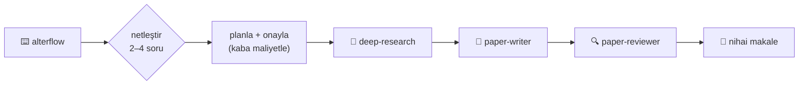

<div align="center">

<br>

<a href="skills/"></a>
<a href="skills/"></a>
<a href="docs/evals.md"></a>
<a href="https://www.anthropic.com"></a>
<a href="LICENSE"></a>
<a href="https://github.com/AlterLab-IEU/AlterLab-Academic-Skills/releases"></a>
<a href="https://agentskills.io"></a>

<br>

<a href="https://github.com/AlterLab-IEU/AlterLab-Academic-Skills/stargazers"></a>
<a href="https://github.com/AlterLab-IEU/AlterLab-Academic-Skills/network/members"></a>
<a href="https://github.com/AlterLab-IEU/AlterLab-Academic-Skills/issues"></a>
<a href="CONTRIBUTING.md"></a>
<a href="https://github.com/AlterLab-IEU/AlterLab-Academic-Skills/actions/workflows/pytest.yml"></a>
<a href="https://github.com/BehiSecc/awesome-claude-skills"></a>

<br>

> 📢 **Şurada öne çıktı:** [awesome-claude-skills](https://github.com/BehiSecc/awesome-claude-skills) (5.7k ⭐)

<br>

**Dil:** [English](README.md) · [Türkçe](README.tr-TR.md)

<br><br>

<h3>🧬 Fakülte üyeleri, araştırmacılar ve akademisyenler için özel olarak tasarlanmış 239 Claude AI becerisi</h3>
<p><em>17 araştırma alanına yayılmış — Türk akademisinden biyoinformatiğe, dijital beşeri bilimlere</em></p>
<p><em>239/239 beceri çalıştırılabilir eval ile gelir · deterministik atıf-doğrulayıcı · claude.ai için alan paketleri</em></p>

<p>🧭 <b>v2.6'da yeni — hangi beceri gerektiğini bilmiyor musunuz?</b> Sadece <b>"AlterLab becerilerini kullan"</b> deyin, Claude sizin için seçsin · <b><code>alterflow</code></b> yazarak tam çok-ajanlı bir iş akışı başlatın</p>

<p>
<b>Araştırma Hattı</b> · <b>Bilimsel Veritabanları</b> · <b>Biyoinformatik</b> · <b>Veri Bilimi</b> · <b>Görselleştirme</b> · <b>Klinik Araştırma</b> · <b>ve daha fazlası</b>
</p>

<p>
<a href="skills/"><b>Becerileri Keşfet »</b></a> · 
<a href="#-hızlı-başlangıç">Hızlı Başlangıç</a> · 
<a href="#%EF%B8%8F-alan-genel-bakışı">Alan Genel Bakışı</a> · 
<a href="CONTRIBUTING.md">Katkıda Bulunma</a> · 
<a href="https://github.com/AlterLab-IEU/AlterLab-Academic-Skills/issues">Hata Bildir</a>
</p>

<br>

<hr>

<table><tr><td>
<b>Geliştiren:</b> <a href="https://github.com/AlterLab-IEU"><b>AlterLab Creative Technologies Laboratory</b></a>
<br><br>
<em>Belirli bir üniversiteye bağlı değildir — bu beceriler her yerdeki her araştırmacı için çalışır.</em>
</td></tr></table>

</div>

<br>

<!-- ÖNE ÇIKAN ÖZELLİKLER -->

<div align="center">
<table>
<tr>
<td align="center" width="25%">
<h3>🎯</h3>
<h3>Tak & Çalıştır</h3>
<p>Bir <code>.md</code> beceri dosyasını<br>Claude Projects veya Claude Code'a<br>bırakın, anında uzmanlık kazanın</p>
</td>
<td align="center" width="25%">
<h3>🧠</h3>
<h3>Alan Uzmanı</h3>
<p>Her beceri, Claude'u derin bilgiye<br>sahip özelleşmiş bir araştırma<br>asistanına dönüştürür</p>
</td>
<td align="center" width="25%">
<h3>🔬</h3>
<h3>Gerçek Çerçeveler</h3>
<p>Gerçek bilimsel yöntemler,<br>araçlar ve profesyonel çıktı<br>şablonları üzerine kuruludur</p>
</td>
<td align="center" width="25%">
<h3>🌐</h3>
<h3>Evrensel</h3>
<p>Her kurumdaki her araştırmacı<br>için çalışır —<br>tedarikçi kilidi yoktur</p>
</td>
</tr>
</table>
</div>

<br>

## ⚡ Hemen Deneyin — Tek Satır, Doğru Beceri

**Beceri adlarını bilmenize gerek yok.** Görevi anlatın; `alterlab-skill-finder` (ön kapı) sizin için beceriyi seçer — hangisini ve neden seçtiğini söyleyerek.

**Yönlendir — tek görev → tek beceri:**

> 💬 *"AlterLab becerilerini kullanarak yöntem bölümümü değerlendir."*
> 🧭 → **`alterlab-paper-reviewer`** (metodoloji odaklı)

> 💬 *"CRISPR hedef-dışı etkileri üzerine makale bulup doğrulayan hangi AlterLab becerisi?"*
> 🧭 → **`alterlab-deep-research`** + **`alterlab-pubmed`**

**`alterflow` — birden çok aşamaya yayılan bir hedef → netleştirilmiş, çok-ajanlı bir iş akışı:**

> 💬 *"**alterflow** — uyku ile bellek arasındaki bağı araştır ve yayımlanabilir bir makaleye dönüştür."*
> 🧭 → **önce** 2–4 kapsam sorusu sorar, sonra planlar ve çalıştırır:



> Yürütmeden önce sorular — asla kör bir 20-ajanlı koşu başlatmaz; basit görevler tek-beceri kalır. Anthropic'in **yönlendirme** ve **orkestratör-işçi** desenleri üzerine kurulu.

<br>

## 📋 İçindekiler

<details open>
<summary><b>Genişletmek / daraltmak için tıklayın</b></summary>
<br>

- [⚡ Hemen Deneyin — Tek Satır, Doğru Beceri](#-hemen-deneyin--tek-satır-doğru-beceri)
- [🚀 Sürüm 2.2.0'da Yenilikler](#-sürüm-220da-yenilikler)
- [🎯 Bu Proje Nedir?](#-bu-proje-nedir)
- [✨ Öne Çıkan Özellikler](#-öne-çıkan-özellikler)
- [🆕 Sürüm 2.0'da Yenilikler](#-sürüm-20da-yenilikler)
- [🗂️ Alan Genel Bakışı](#%EF%B8%8F-alan-genel-bakışı)
- [🚀 Hızlı Başlangıç](#-hızlı-başlangıç)
- [⚡ Çekirdek Hat — 10 Beceri](#-çekirdek-hat--10-beceri)
- [📚 239 Becerinin Tamamı](#-239-becerinin-tamamı)
- [🏗️ Proje Yapısı](#%EF%B8%8F-proje-yapısı)
- [⚙️ Beceriler Nasıl Çalışır?](#%EF%B8%8F-beceriler-nasıl-çalışır)
- [💡 Kullanım Örnekleri](#-kullanım-örnekleri)
- [📖 Bu Depoyu Atıfla](#-bu-depoyu-atıfla)
- [🤝 Katkıda Bulunma](#-katkıda-bulunma)
- [📜 Lisans](#-lisans)
- [🙏 Teşekkürler](#-teşekkürler)

</details>

<br>

## 🚀 Sürüm 2.2.0'da Yenilikler

- 🧠 **191 becerinin araştırma-temelli yükseltilmesi** — önceden var olan tüm becerilerde doğruluk ve derinlik geçişi: düzeltilmiş mevzuat/API ayrıntıları, `references/` içine inceltilen gövdeler ve sürüm artışları. 
- 🧩 **Yeni çekirdek beceri: İş Akışı Orkestrasyonu** (`alterlab-workflow-orchestration`) — AlterLab becerilerini çok-ajanlı iş akışlarına dönüştürür; koleksiyon **210 beceriye** yükseldi. → [Çekirdek Hat](#-çekirdek-hat--10-beceri)

- 🇹🇷 **Türk Akademisi amiral suiti (12 beceri)** — herhangi bir beceri kütüphanesindeki en kapsamlı Türk-akademi suiti: DergiPark, TR Dizin, YÖK Tez, YÖK Akademik, YÖKATLAS, TÜBİTAK 1001/1002-A önerileri, doçentlik uygunluğu, akademik teşvik puanlama, Türkçe APA-7 üslubu, etik kurul başvuruları, KVKK veri yönetim planları ve TÜBİTAK Aperta — her biri doğrulanmış bir ulusal-platform uç noktasına bağlı. → [Türk Akademisi](#-türk-akademisi--ulusal-platformlar--akademik-iş-akışı-12-beceri)
- 🎓 **Fakülte Yaşamı (6 beceri)** — müfredat yapay zeka politikası, ödül-sonrası hibe raporlama, tavsiye mektupları, AACSB/ABET akreditasyonu (AoL), REDCap/CDISC veri toplama ve ön baskı deposu. → [Fakülte Yaşamı](#-fakülte-yaşamı--öğretim-hizmet--akademik-kariyer-6-beceri)
- 🧪 **Metodoloji (3 beceri)** — araştırma yöntemlerine uygulanan superpowers tarzı titizlik (Demir Kurallar, Bahane-Gerçek tabloları): ön kayıt disiplini, istatistiksel-test seçim koruması ve sonuç-raporlama şeffaflığı. → [Metodoloji](#-metodoloji--araştırma-titizliği--disiplin-kapıları-3-beceri)
- 🧬 **Biyoinformatik 25 → 30'a çıktı** — üretim hatları: nf-core/sarek varyant çağırma, QIIME 2 amplikon, salmon/kallisto RNA-seq nicelleme, NCBI BLAST+ ve Squidpy uzamsal transkriptomik. → [Biyoinformatik](#-biyoinformatik--genomik-proteomik-ve-moleküler-biyoloji-30-beceri)
- ✅ **26 yeni becerinin tamamında ilk günden eval** — kapsam **210 / 210** olarak kalır; şema + kapsam denetimi her PR'da CI'da çalışır, davranışsal eval geçişi ise istek üzerine (`workflow_dispatch`) yürütülür. → [`docs/evals.md`](docs/evals.md)

<br>

## 🎯 Bu Proje Nedir?

Fakülte üyeleri, akademisyenler ve araştırmacılar için tasarlanmış, **özel amaçlı 239 Claude AI becerisinden** oluşan kapsamlı bir paket — akademik araştırma yaşam döngüsünün tamamını kapsayacak şekilde **17 alan kategorisine** ayrılmıştır.

Her beceri, Claude'u akademik araştırma, bilimsel hesaplama ve akademik yayıncılık iş akışlarına göre uyarlanmış **alana özgü bir uzman asistana** dönüştürür.

> [!TIP]
> **Nasıl çalışır:** Her beceri yapılandırılmış bir `SKILL.md` dosyasıdır. Koleksiyonu bir Claude Code eklentisi olarak kurun ya da bir beceri dizinini `~/.claude/skills/` (veya bir projenin `.claude/skills/`) dizinine kopyalayın — Claude böylece gerçek bilimsel çerçeveler, profesyonel çıktı şablonları ve derin alan bilgisiyle donanmış araştırma uzmanınız olur. Başıboş bir `.md` dosyası **otomatik olarak yüklenmez**.

<br>

## ✨ Öne Çıkan Özellikler

| | Özellik | Açıklama |
|:---:|:---|:---|
| 🧭 | **Tek Komutluk Ön Kapı** | Yalnızca *"AlterLab becerilerini kullan"* deyin — `alterlab-skill-finder` sizin için doğru beceri(ler)i seçer; **`alterflow`** anahtar sözcüğü hedefinizi netleştirip çok-ajanlı bir iş akışı başlatır |
| 🔬 | **Araştırmaya Hazır** | Çalışan araştırmacıların kullandığı gerçek bilimsel yöntemler, veritabanları ve profesyonel çerçeveler üzerine kurulu beceriler |
| 🤖 | **Çok-Ajanlı Hatlar** | Çekirdek beceriler zincirlenir: Araştır → Yaz → Değerlendir → Yayınla, kesintisiz bir iş akışında |
| 📊 | **39 Veritabanı Entegrasyon Becerisi** | PubMed, ChEMBL, UniProt, ClinicalTrials.gov, COSMIC ve daha fazlasına anında erişim |
| 🧬 | **Derin Alan Kapsamı** | Tek hücre RNA-seq analizinden kuantum hesaplamaya, klinik denemelerden dijital beşeri bilimlere |
| 📝 | **Yayın Kalitesinde Çıktı** | LaTeX makaleler, konferans posterleri, hibe önerileri, bilimsel görselleştirmeler — tümü profesyonel standartlarda biçimlendirilmiş |
| 🔄 | **Karıştır & Eşleştir** | Tek bir Claude Projesi içinde birden çok beceriyi birleştirerek çok-uzmanlı bir araştırma ekibi kurun |

<br>

## 🆕 Sürüm 2.0'da Yenilikler

Sürüm 2.0, koleksiyonu bir beceri listesinden **denetlenmiş, doğrulanmış ve birlikte çalışabilir** bir araştırma araç takımına dönüştürür.

| | Özellik | Açıklama |
|:---:|:---|:---|
| ✅ | **Davranışsal Eval Kapsamı** | 239 becerinin **tamamı** (%100) Anthropic'in tetikleme/tetiklememe biçimini izleyen `evals/evals.json` dosyalarıyla gelir; `scripts/run_evals.py` ile çalıştırılır |
| 🔎 | **Atıf Doğrulayıcı** | Yeni `alterlab-citation-verifier` becerisi, bir kaynakçadaki her girdinin **gerçekten var olduğunu** dört anahtarsız bilimsel API (Crossref, OpenAlex, Semantic Scholar, arXiv) üzerinden çapraz kontrol ederek doğrular |
| 📦 | **Alan Paketleri (Domain Packs)** | Tüm alanlar, bağımsız olarak kurulabilen Claude Code eklentileri olarak paketlenir — yalnızca ihtiyacınız olanı kurun, tüm depoyu değil |
| 🔌 | **MCP Öncelikli Veri** | Beceriler, ilgili MCP araçları (PubMed, Scholar Gateway, Clinical Trials, Hugging Face) mevcut olduğunda eğitim verisi yerine **canlı veriyi** tercih eder ve kaynağı + erişim tarihini gösterir |
| ⌨️ | **Slash Komutları** | Çekirdek iş akışları için doğrudan komutlar: `/research-pipeline`, `/lit-review`, `/review-paper`, `/cite-check` |
| 🔁 | **Genişletilmiş Çekirdek Hat** | Çekirdek hat artık **10 beceri** içeriyor — atıf doğrulama, bağlantı sağlığı denetimi ve *"AlterLab becerilerini kullan"* isteğini doğru beceriye çeviren `alterlab-skill-finder` ön kapı yönlendiricisi de dahil |

> [!NOTE]
> Eval kapsamı artık tüm koleksiyonu kapsar (239 / 239). Tam değişiklik geçmişi için [CHANGELOG.md](CHANGELOG.md) dosyasına bakın.

### 🚀 v2.0'deki ek yenilikler

Yukarıdaki tabloyu tamamlayan, v2.0 ile gelen başlıca sayfa eklentileri:

| | Yenilik | Ayrıntı |
|:---:|:---|:---|
| 🌐 | **Canlı Katalog** | 210 becerinin tamamı, gözatılabilir bir web kataloğunda yayımlanır: [alterlab-ieu.github.io/AlterLab-Academic-Skills](https://alterlab-ieu.github.io/AlterLab-Academic-Skills/) — kurulum yapmadan tüm koleksiyonu inceleyin |
| 🤖 | **Kayıtlı Alt-Ajanlar** | Çekirdek hat, `core` eklentisiyle birlikte kaydedilen özelleşmiş alt-ajanlar olarak gelir; eğik çizgi komutları (`/research-pipeline`, `/lit-review`, `/review-paper`, `/cite-check`) ve birlikte paketlenen akademik MCP (PubMed / OpenAlex / Crossref / Zotero) ile sürülür |
| 🗂️ | **Üretilen Katalog** | Makine okunabilir [`skills.json`](skills.json), beceri frontmatter'ından otomatik üretilir; bir CI kapısı bu README'deki her sayımı doğrular ve dürüst tutar |
| 📜 | **Dürüst Köken** | Bu depo, MIT lisanslı [K-Dense `scientific-agent-skills`](https://github.com/K-Dense-AI/scientific-agent-skills) projesinden içerik çatallamasıdır; köken [`THIRD_PARTY_NOTICES.md`](THIRD_PARTY_NOTICES.md), [`PROVENANCE.md`](PROVENANCE.md) ve [`CITATION.cff`](CITATION.cff) dosyalarında açıkça belgelenir |

> [!TIP]
> **Kataloğa göz atın:** Becerileri kurmadan önce tarayıcınızdan keşfedin — alana göre filtreleyin, açıklamaları okuyun ve hangi becerinin ne zaman tetiklendiğini görün: **[alterlab-ieu.github.io/AlterLab-Academic-Skills](https://alterlab-ieu.github.io/AlterLab-Academic-Skills/)**

<br>

## 🗂️ Alan Genel Bakışı

| | Alan | Beceri | Odak Alanları |
|:---:|:---|:---:|:---|
| 🔄 | **Çekirdek Hat** | **10** | Çok-ajanlı araştır → yaz → değerlendir → yayınla hattı + öğretim + tez + bütünlük araçları + iş akışı orkestrasyonu + beceri bulucu yönlendirici |
| 🗄️ | **Veritabanları** | **39** | Bilimsel veritabanı bağlayıcıları — PubMed, ChEMBL, UniProt, ClinicalTrials.gov, COSMIC ve daha fazlası |
| 🧬 | **Biyoinformatik** | **30** | Genomik, proteomik, moleküler biyoloji — Scanpy, BioPython, ESM, tek hücre analizi, nf-core/sarek, QIIME 2, RNA-seq nicelleme |
| ⚗️ | **Kemoinformatik** | **12** | Kimya ve ilaç keşfi — RDKit, moleküler dinamik, docking, ADMET |
| 🏥 | **Klinik Araştırma** | **7** | Klinik karar desteği, tedavi planlaması, tıbbi görüntüleme, regülasyon |
| 📊 | **Veri Bilimi** | **22** | ML/istatistik — scikit-learn, PyTorch Lightning, SHAP, transformerlar |
| 📈 | **Görselleştirme** | **8** | Bilimsel grafik — Matplotlib, Seaborn, Plotly, şematikler, infografikler |
| ✍️ | **Akademik Yazım** | **13** | Bilimsel yazım, atıflar, hibeler, posterler, akademik kariyer |
| 🔧 | **Laboratuvar Entegrasyonları** | **9** | Laboratuvar platformları — Benchling, DNAnexus, Opentrons, Protocols.io |
| 🌍 | **Alan-Spesifik** | **17** | Kuantum hesaplama, jeo-uzamsal, malzeme bilimi, sosyal bilim yöntemleri, dijital beşeri bilimler |
| 📄 | **Doküman Araçları** | **2** | Markdown ve belge dönüştürme — MarkItDown, Open Notebook |
| 🔍 | **Araştırma Araçları** | **14** | Arama, keşif, Zotero, nitel yöntemler, etik, anketler, açık bilim, atıf grafiği |
| 💰 | **Finans & Ekonomi** | **7** | FRED, Alpha Vantage, SEC EDGAR, piyasa araştırması |
| 🇹🇷 | **Türk Akademisi** | **12** | Ulusal platformlar & akademik iş akışı — DergiPark, TR Dizin, YÖK Tez/Akademik, YÖKATLAS, TÜBİTAK önerileri, doçentlik, teşvik, KVKK, Aperta |
| 🎓 | **Fakülte Yaşamı** | **6** | Öğretim, hizmet & akademik kariyer — müfredat YZ politikası, hibe raporlama, tavsiye mektupları, akreditasyon, REDCap/CDISC, ön baskılar |
| 🧪 | **Metodoloji** | **3** | Araştırma-titizliği disiplin kapıları — ön kayıt, test-seçim koruması, sonuç-raporlama şeffaflığı |
| 🧭 | **Sosyal Bilim İş Akışı** | **17** | Aşamalı yöntem omurgası — orkestratör + 5 geçerlilik kapısı (tasarım, ölçüm, örnekleme, refleksivite, çıkarım) + 11 analiz modülü (nedensel çıkarım, anket-analizi, YEM/psikometri, çok-düzeyli modeller, QCA, SNA, ABM, metin-veri, nitel-analiz, meta-analiz, eksik-veri) |
<br>

## 🚀 Hızlı Başlangıç

### 🎓 Yeni misiniz / teknik değil misiniz? **Claude uygulamasında** başlayın — terminal ve git yok

Beceriler **claude.ai (tarayıcı)** ve **Claude masaüstü uygulamasında** basit bir yükleme ile çalışır — komut satırı gerekmez:

1. Claude'da **kod yürütmenin** açık olduğundan emin olun: **Ayarlar → Yetenekler** *(Team/Enterprise: bir yönetici bunu kuruluş için bir kez açar)*.
2. **Özelleştir ▸ Beceriler** bölümünü açın → **[claude.ai/customize/skills](https://claude.ai/customize/skills)**.
3. **`+`** → **Beceri oluştur** → **Beceri yükle** öğesine tıklayın ve bir becerinin **`.zip`** dosyasını seçin.
4. Becerinin anahtarını **Açık** konuma getirin. Artık normal şekilde sohbet edin — Claude, isteğiniz eşleştiğinde beceriyi otomatik kullanır.

**`.zip` dosyasını nereden alırım? Terminal gerektirmeyen iki yol:**

- **Tek beceri** — bu deponun üstündeki yeşil **`< > Code` ▸ Download ZIP** düğmesine tıklayın, arşivi açın, istediğiniz beceri klasörüne (ör. `skills/bioinformatics/alterlab-scanpy`) sağ tıklayıp **Sıkıştır / Zip** yapın. *O* zip'i yükleyin.
- **Bütün bir alan** — [Sürümler sayfasından](https://github.com/AlterLab-IEU/AlterLab-Academic-Skills/releases) hazır bir paket indirin (ör. `bioinformatics.zip`).

> [!IMPORTANT]
> Sohbete sürüklenen gevşek bir `.md` dosyası kurulu bir beceri **değildir** — `SKILL.md` dosyasını içeren bir **beceri klasörünün zip'i** olmalıdır. Yalnızca güvendiğiniz kaynaklardan beceri kurun; uygulamada yüklediğiniz beceriler hesabınıza bağlıdır ve Claude Code ile senkronize olmaz.

<br>

*Terminal veya Claude Code kullanmaya alışkın mısınız? Bunun yerine aşağıdaki seçeneklerden birini seçin.*

### 🌍 Seçenek 1 — Agent Skills (açık standart) *(Önerilen)*

```bash
npx skills add AlterLab-IEU/AlterLab-Academic-Skills
```

Bunlar [agentskills.io](https://agentskills.io) açık standardını izleyen taşınabilir **Agent Skills** becerileridir — yalnızca Claude'da değil, **Cursor, Codex, Gemini CLI ve Copilot** ile de çalışırlar.

> [!NOTE]
> **Standart: Agent Skills.** Bu koleksiyon açık Agent Skills standardına uygundur. Şartname ve destekleyen ajanların listesi için [agentskills.io](https://agentskills.io) adresine bakın.

### ⚡ Seçenek 2 — Claude Code Eklentisi

Pazarı bir kez ekleyin, ardından yalnızca ihtiyacınız olan alanları kurun:

```bash
/plugin marketplace add AlterLab-IEU/AlterLab-Academic-Skills
# SSH anahtarınız yok mu? HTTPS pazar yolunu kullanın:
/plugin marketplace add https://github.com/AlterLab-IEU/AlterLab-Academic-Skills.git
/plugin install alterlab-bioinformatics@alterlab-academic-skills
/reload-plugins
```

Bir klon üzerinde yerel geliştirme için Claude Code'u doğrudan dizine yönlendirin:

```bash
claude --plugin-dir /path/to/AlterLab-Academic-Skills
```

Mevcut alan eklentileri (17): `alterlab-core`, `alterlab-databases`, `alterlab-bioinformatics`, `alterlab-cheminformatics`, `alterlab-clinical-research`, `alterlab-data-science`, `alterlab-visualization`, `alterlab-writing-tools`, `alterlab-lab-integrations`, `alterlab-domain-specific`, `alterlab-document-tools`, `alterlab-research-tools`, `alterlab-finance-economics`, `alterlab-turkish-academia`, `alterlab-faculty-life`, `alterlab-methodology`, `alterlab-social-science-workflow`.

### 📁 Seçenek 3 — Kişisel veya Proje Kurulumu (elle)

```bash
git clone https://github.com/AlterLab-IEU/AlterLab-Academic-Skills.git
# Kişisel — her projede kullanılabilir:
cp -R AlterLab-Academic-Skills/skills/bioinformatics/alterlab-scanpy ~/.claude/skills/
# Proje kapsamlı — yalnızca mevcut depoda:
cp -R AlterLab-Academic-Skills/skills/bioinformatics/alterlab-scanpy .claude/skills/
```

Ardından Claude Code'u yeniden başlatın. Bir beceri `~/.claude/skills/<ad>/SKILL.md` veya `.claude/skills/<ad>/SKILL.md` yolunda bulunmalıdır — yalnızca `git clone` yapmak hiçbir şeyi kaydetmez.

### 🌐 Seçenek 4 — Claude.ai

Bir becerinin dizinini `.zip` olarak sıkıştırın, ardından **Özelleştir ▸ Beceriler** ([claude.ai/customize/skills](https://claude.ai/customize/skills)) → **`+`** → **Beceri oluştur** → **Beceri yükle** ile yükleyin (**Ayarlar → Yetenekler** altında kod yürütme etkin olmalıdır). Terminalsiz adım adım kılavuz için yukarıdaki **Claude uygulamasında başlayın** bölümüne bakın. Beceriler claude.ai ile Claude Code arasında senkronize olmaz.

<br>

---

## ⚡ Çekirdek Hat — 10 Beceri

> *Sistemin kalbi — 39 özelleşmiş ajanlı, araştırmadan yayına çok-ajanlı bir üretim hattı; ayrıca öğretim, tez danışmanlığı ve bütünlük doğrulama araçları.*

| # | Beceri | Ajan | Ne Yapar |
|:---:|:---|:---:|:---|
| 1 | **🔬 Derin Araştırma** | 13 | Sistematik inceleme, Sokratik diyalog ve kaynak doğrulama ile çok-modlu araştırma |
| 2 | **📝 Makale Yazarı** | 12 | LaTeX, çift-dilli destek ve 9 yazım moduyla akademik makale üretimi |
| 3 | **🔍 Makale Hakemi** | 7 | Şeytanın Avukatı dahil çoklu-perspektif hakemlik, 0–100 kalite rubrikleri |
| 4 | **🔄 Araştırma Hattı** | 7 | Bütünlük doğrulaması ve materyal pasaportları içeren 10 aşamalı orkestratör |
| 5 | **🎓 Öğretim Tasarımı** | — | Ders tasarımı, müfredat, rubrikler, Bloom taksonomisi, geriye dönük tasarım |
| 6 | **📋 Tez Danışmanı** | — | Tez rehberliği, savunma hazırlığı, jüri yönetimi |
| 7 | **🔎 Atıf Doğrulayıcı** | — | Kaynakçadaki her girdiyi dört anahtarsız bilimsel API üzerinden doğrular |
| 8 | **🔗 Bağlantı Sağlığı** | — | Depo genelinde bağlantı sağlığı denetimi meta-becerisi |
| 9 | **🧩 İş Akışı Orkestrasyonu** | — | AlterLab becerilerini çok-ajanlı iş akışlarına dönüştürür: paralel alt-ajan dağıtımı, hatlar, jüri panelleri, çekişmeli doğrulama |
| 10 | **🧭 Beceri Bulucu** | — | Ön kapı yönlendiricisi — *"AlterLab becerilerini kullan"* isteğini doğru beceri(ler)e çevirir; **`alterflow`** anahtar sözcüğü hedefi netleştirip dinamik çok-ajanlı bir iş akışı başlatır |

### Tam Hat Akışı

```
derin-araştırma (sokratik/tam)
  → makale-yazarı (plan/tam)
    → makale-hakemi (tam/rehberli)
      → makale-yazarı (revizyon)
        → makale-hakemi (yeniden hakemlik, en fazla 2 döngü)
          → atıf-doğrulayıcı (kaynakça bütünlük kontrolü)
            → makale-yazarı (format dönüşümü → nihai çıktı)
```

<br>

---

## 📚 239 Becerinin Tamamı

### 🗄️ Veritabanları — Bilimsel Veritabanı Bağlayıcıları (39 Beceri)

<details>
<summary><b>Tam veritabanı beceri listesini görmek için tıklayın</b></summary>
<br>

| # | Beceri | Ne Yapar |
|:---:|:---|:---|
| 1 | **AlphaFold DB** | AlphaFold'dan protein yapısı tahminleri |
| 2 | **arXiv** | Ön baskı arama ve keşfi |
| 3 | **BindingDB** | İlaç-hedef etkileşimleri için bağlanma afinitesi verileri |
| 4 | **bioRxiv** | Biyoloji ön baskı arama ve izleme |
| 5 | **BRENDA** | Enzim işlevsel verileri |
| 6 | **cBioPortal** | Kanser genomiği veri keşfi |
| 7 | **ChEMBL** | İlaç benzeri özelliklere sahip biyoaktif moleküller |
| 8 | **ClinicalTrials.gov** | Klinik deneme kayıt aramaları |
| 9 | **ClinPGx** | Klinik farmakogenomik verileri |
| 10 | **ClinVar** | Genomik varyasyon ve insan sağlığı |
| 11 | **COSMIC** | Kanserdeki somatik mutasyonlar kataloğu |
| 12 | **Data Commons** | Google'ın açık bilgi grafiği |
| 13 | **DepMap** | Kanser bağımlılığı haritalaması |
| 14 | **DrugBank** | İlaç ve ilaç hedefi bilgileri |
| 15 | **ENA** | Avrupa Nükleotid Arşivi |
| 16 | **Ensembl** | Genom anotasyonu ve varyasyon |
| 17 | **FDA** | FDA ilaç ve cihaz verileri |
| 18 | **Gene DB** | Gen düzeyinde veri toplama |
| 19 | **GEO** | Gene Expression Omnibus veri kümeleri |
| 20 | **gnomAD** | Genom toplama ve varyant sıklığı |
| 21 | **GTEx** | Dokuya özgü gen ifadesi |
| 22 | **GWAS Catalog** | Genom çapında ilişkilendirme çalışmaları |
| 23 | **HMDB** | İnsan Metabolom Veritabanı |
| 24 | **Imaging Data Commons** | Kanser görüntüleme verileri |
| 25 | **InterPro** | Protein aileleri ve domainleri |
| 26 | **JASPAR** | Transkripsiyon faktörü bağlanma profilleri |
| 27 | **KEGG** | Biyolojik yolaklar ve ağlar |
| 28 | **Metabolomics Workbench** | Metabolomik veri deposu |
| 29 | **Monarch Initiative** | Hastalık-gen ilişkilendirmeleri |
| 30 | **OpenAlex** | Açık bilimsel üst veri |
| 31 | **Open Targets** | İlaç hedefi tanımlama |
| 32 | **PDB** | Protein 3B yapı veritabanı |
| 33 | **PubChem** | Kimyasal bilgi veritabanı |
| 34 | **PubMed** | Biyomedikal literatür araması |
| 35 | **Reactome** | Biyolojik yolak veritabanı |
| 36 | **STRING** | Protein-protein etkileşim ağları |
| 37 | **UniProt** | Protein dizisi ve işlevi |
| 38 | **USPTO** | Patent arama ve analizi |
| 39 | **ZINC** | Docking için ticari olarak erişilebilir bileşikler |

</details>

### 🧬 Biyoinformatik — Genomik, Proteomik ve Moleküler Biyoloji (30 Beceri)

<details>
<summary><b>Tam biyoinformatik beceri listesini görmek için tıklayın</b></summary>
<br>

| # | Beceri | Ne Yapar |
|:---:|:---|:---|
| 1 | **AnnData** | Tek hücre için anotasyonlu veri matrisleri |
| 2 | **Arboreto** | Gen düzenleyici ağ çıkarımı |
| 3 | **BioPython** | Genel amaçlı biyoinformatik araç takımı |
| 4 | **BioServices** | Biyolojik web servislerine programatik erişim |
| 5 | **CellxGene** | Etkileşimli tek hücre veri keşfi |
| 6 | **COBRApy** | Kısıt tabanlı metabolik modelleme |
| 7 | **deepTools** | NGS veri analizi ve görselleştirme |
| 8 | **ESM** | Protein dil modelleri |
| 9 | **ETE Toolkit** | Filogenetik ağaç analizi ve görselleştirme |
| 10 | **FlowIO** | Akış sitometrisi veri işleme |
| 11 | **gget** | Python'dan genomik veritabanı sorgulama |
| 12 | **Glycoengineering** | Glikan analizi ve mühendisliği |
| 13 | **HistoLab** | Hesaplamalı histopatoloji |
| 14 | **LaminDB** | Veri soyu ve biyolojik veri yönetimi |
| 15 | **Neuropixels** | Sinirsel prob veri işleme |
| 16 | **PathML** | Patoloji için makine öğrenmesi |
| 17 | **Phylogenetics** | Evrimsel ağaç oluşturma |
| 18 | **PyDESeq2** | Diferansiyel gen ifadesi analizi |
| 19 | **pyOpenMS** | Kütle spektrometrisi veri analizi |
| 20 | **pysam** | SAM/BAM dosya işleme |
| 21 | **Scanpy** | Python'da tek hücre analizi |
| 22 | **scikit-bio** | Biyoinformatik algoritmaları ve veri yapıları |
| 23 | **scVelo** | RNA velositesi analizi |
| 24 | **scvi-tools** | Tek hücre için derin üretken modeller |
| 25 | **TileDB-VCF** | Popülasyon ölçekli genomik varyant depolama |
| 26 | **BLAST** | NCBI BLAST+ komut satırı dizi benzerliği aramaları |
| 27 | **nf-core/sarek** | FASTQ'dan VCF'ye germline & somatik varyant çağırma hattı |
| 28 | **QIIME 2 Amplikon** | 16S/ITS mikrobiyom amplikon analizi |
| 29 | **RNA-seq Nicelleme** | salmon & kallisto ile transkript bolluğu |
| 30 | **Squidpy Uzamsal** | AnnData/SpatialData üzerinde uzamsal transkriptomik |

</details>

### ⚗️ Kemoinformatik — Kimya ve İlaç Keşfi (12 Beceri)

<details>
<summary><b>Tam kemoinformatik beceri listesini görmek için tıklayın</b></summary>
<br>

| # | Beceri | Ne Yapar |
|:---:|:---|:---|
| 1 | **Datamol** | Moleküler veri işleme |
| 2 | **DeepChem** | Kimya için derin öğrenme |
| 3 | **DiffDock** | Difüzyon tabanlı moleküler docking |
| 4 | **matchms** | Kütle spektrumu eşleştirme ve benzerlik |
| 5 | **MedChem** | Tıbbi kimya analizi |
| 6 | **Molecular Dynamics** | MD simülasyon kurulumu ve analizi |
| 7 | **MolFeat** | Moleküler özellik çıkarımı |
| 8 | **PrimeKG** | Hassas tıp bilgi grafiği |
| 9 | **PyTDC** | Therapeutics Data Commons erişimi |
| 10 | **RDKit** | Çekirdek kemoinformatik araç takımı |
| 11 | **Rowan** | Hesaplamalı kimya iş akışları |
| 12 | **TorchDrug** | İlaç keşfi için grafik sinir ağları |

</details>

### 🏥 Klinik Araştırma — Klinik Karar Desteği ve Tıbbi Araçlar (7 Beceri)

<details>
<summary><b>Tam klinik araştırma beceri listesini görmek için tıklayın</b></summary>
<br>

| # | Beceri | Ne Yapar |
|:---:|:---|:---|
| 1 | **Clinical Decision** | Kanıta dayalı klinik karar desteği |
| 2 | **Clinical Reports** | Yapılandırılmış klinik rapor üretimi |
| 3 | **ISO 13485** | Tıbbi cihaz kalite yönetimi |
| 4 | **NeuroKit2** | Nörofizyolojik sinyal işleme |
| 5 | **PyDicom** | DICOM tıbbi görüntü işleme |
| 6 | **PyHealth** | Sağlık hizmetleri ML hatları |
| 7 | **Treatment Plans** | Tedavi planlaması ve protokol tasarımı |

</details>

### 📊 Veri Bilimi — ML, İstatistik ve Veri Analizi (22 Beceri)

<details>
<summary><b>Tam veri bilimi beceri listesini görmek için tıklayın</b></summary>
<br>

| # | Beceri | Ne Yapar |
|:---:|:---|:---|
| 1 | **Dask** | Paralel hesaplama ve bellek dışı veri |
| 2 | **EDA** | Keşifsel veri analizi |
| 3 | **NetworkX** | Ağ/grafik analizi |
| 4 | **Polars** | Yüksek performanslı DataFrame'ler |
| 5 | **PufferLib** | Pekiştirmeli öğrenme ortamları |
| 6 | **PyMC** | Bayes istatistiksel modelleme |
| 7 | **pymoo** | Çok-amaçlı optimizasyon |
| 8 | **PyTorch Lightning** | Yapılandırılmış derin öğrenme eğitimi |
| 9 | **scikit-learn** | Klasik makine öğrenmesi |
| 10 | **scikit-survival** | Sağkalım analizi |
| 11 | **SHAP** | Model yorumlanabilirliği ve özellik önemi |
| 12 | **SimPy** | Ayrık olay simülasyonu |
| 13 | **Stable-Baselines3** | Pekiştirmeli öğrenme algoritmaları |
| 14 | **Statistical Analysis** | Klasik istatistiksel testler ve yöntemler |
| 15 | **statsmodels** | İstatistiksel modeller ve ekonometri |
| 16 | **SymPy** | Sembolik matematik |
| 17 | **TimesFM** | Zaman serileri için temel model |
| 18 | **PyTorch Geometric** | Grafik sinir ağları |
| 19 | **Transformers** | Hugging Face transformer modelleri |
| 20 | **UMAP** | Boyut indirgeme |
| 21 | **Vaex** | Büyük veri için bellek dışı DataFrame'ler |
| 22 | **Zarr** | Parçalanmış, sıkıştırılmış N-boyutlu diziler |

</details>

### 📈 Görselleştirme — Bilimsel Grafik ve Çizim (8 Beceri)

<details>
<summary><b>Tam görselleştirme beceri listesini görmek için tıklayın</b></summary>
<br>

| # | Beceri | Ne Yapar |
|:---:|:---|:---|
| 1 | **Generate Image** | Araştırma figürleri için yapay zeka görsel üretimi |
| 2 | **Infographics** | Araştırma infografiği tasarımı |
| 3 | **Matplotlib** | Yayın kalitesinde 2B grafikler |
| 4 | **Mermaid** | Kod olarak diyagramlar ve akış şemaları |
| 5 | **Plotly** | Etkileşimli bilimsel görselleştirmeler |
| 6 | **Scientific Schematics** | Teknik diyagramlar ve şematikler |
| 7 | **Scientific Viz** | Gelişmiş bilimsel görselleştirme |
| 8 | **Seaborn** | İstatistiksel veri görselleştirme |

</details>

### ✍️ Akademik Yazım — Bilimsel Yazım, Atıflar ve Yayıncılık (13 Beceri)

<details>
<summary><b>Tam akademik yazım beceri listesini görmek için tıklayın</b></summary>
<br>

| # | Beceri | Ne Yapar |
|:---:|:---|:---|
| 1 | **Academic Career** | Akademik CV, araştırma beyanları, kadro dosyası |
| 2 | **Citation Management** | Kaynak biçimlendirme ve yönetimi |
| 3 | **Hypothesis Generator** | Araştırma hipotezi geliştirme |
| 4 | **LaTeX Posters** | LaTeX'te konferans posteri tasarımı |
| 5 | **Literature Review** | Sistematik literatür taraması desteği |
| 6 | **Paper-to-Web** | Makaleleri web dostu biçimlere dönüştürme |
| 7 | **Peer Review** | Hakemlik yazımı desteği |
| 8 | **PPTX Posters** | PowerPoint'te konferans posterleri |
| 9 | **Research Grants** | Hibe önerisi yazımı |
| 10 | **Scholar Eval** | Akademik çıktı değerlendirmesi |
| 11 | **Scientific Slides** | Araştırma sunumu oluşturma |
| 12 | **Scientific Writing** | Akademik yazım üslubu ve yapısı |
| 13 | **Venue Templates** | Dergi/konferans biçimlendirme şablonları |

</details>

### 🔧 Laboratuvar Entegrasyonları — Laboratuvar Platformu Bağlayıcıları (9 Beceri)

<details>
<summary><b>Tam laboratuvar entegrasyonu beceri listesini görmek için tıklayın</b></summary>
<br>

| # | Beceri | Ne Yapar |
|:---:|:---|:---|
| 1 | **Benchling** | Moleküler biyoloji veri platformu |
| 2 | **DNAnexus** | Genomik veri analiz platformu |
| 3 | **Ginkgo Cloud** | Sentetik biyoloji platformu |
| 4 | **LabArchive** | Elektronik laboratuvar defteri |
| 5 | **LatchBio** | Biyoinformatik iş akışı platformu |
| 6 | **OMERO** | Biyolojik görüntü yönetimi |
| 7 | **Opentrons** | Laboratuvar otomasyonu ve robotik |
| 8 | **Protocols.io** | Protokol paylaşımı ve yönetimi |
| 9 | **PyLabRobot** | Laboratuvar robotiği programlama |

</details>

### 🌍 Alan-Spesifik — Kuantum, Jeo-uzamsal, Malzeme, Sosyal Bilim ve Daha Fazlası (17 Beceri)

<details>
<summary><b>Tam alan-spesifik beceri listesini görmek için tıklayın</b></summary>
<br>

| # | Beceri | Ne Yapar |
|:---:|:---|:---|
| 1 | **Adaptyv** | Uyarlanabilir deneysel tasarım |
| 2 | **Aeon** | Zaman serisi sınıflandırması |
| 3 | **AstroPy** | Astronomi ve astrofizik |
| 4 | **Cirq** | Kuantum devre tasarımı (Google) |
| 5 | **FluidSim** | Akışkan dinamiği simülasyonu |
| 6 | **GeniML** | Genomik aralık ML |
| 7 | **GeoMaster** | Jeo-uzamsal analiz uzmanlığı |
| 8 | **GeoPandas** | Jeo-uzamsal veri analizi |
| 9 | **GTARS** | Anotasyon için genomik araç |
| 10 | **HypoGenic** | Veriden hipotez üretimi |
| 11 | **Modal** | Araştırma için bulut hesaplama |
| 12 | **PennyLane** | Kuantum makine öğrenmesi |
| 13 | **Pymatgen** | Malzeme bilimi analizi |
| 14 | **Qiskit** | Kuantum hesaplama (IBM) |
| 15 | **QuTiP** | Kuantum dinamiği simülasyonu |
| 16 | **Social Science Methods** | Söylem analizi, QCA, Delphi, süreç izleme |
| 17 | **Digital Humanities** | Metin madenciliği, korpus dilbilimi, biçembilim, OCR |

</details>

### 📄 Doküman Araçları — Markdown ve Belge Dönüştürme (2 Beceri)

<details>
<summary><b>Tam doküman araçları beceri listesini görmek için tıklayın</b></summary>
<br>

| # | Beceri | Ne Yapar |
|:---:|:---|:---|
| 1 | **MarkItDown** | Belgeleri Markdown'a dönüştürme |
| 2 | **Open Notebook** | Açık biçimli araştırma defterleri |

</details>

### 🔍 Araştırma Araçları — Arama, Keşif, Yöntemler ve Kaynak Yönetimi (14 Beceri)

<details>
<summary><b>Tam araştırma araçları beceri listesini görmek için tıklayın</b></summary>
<br>

| # | Beceri | Ne Yapar |
|:---:|:---|:---|
| 1 | **BGPT Search** | Yapay zeka destekli araştırma araması |
| 2 | **Citation Graph** | OpenAlex ile atıf ve eş-atıf grafiği (ResearchRabbit benzeri) |
| 3 | **Mixed Methods** | Karma yöntem araştırma tasarımı ve entegrasyonu |
| 4 | **Open Science** | Ön kayıt, FAIR veri, açık erişim yayıncılık |
| 5 | **Parallel Web** | Çok-kaynaklı paralel web araması |
| 6 | **PDF Extract** | N adet PDF'ten makale başına kanıt tablosu (Elicit benzeri) |
| 7 | **Perplexity** | Perplexity destekli araştırma sorguları |
| 8 | **PyZotero** | Zotero kaynak yöneticisi entegrasyonu |
| 9 | **Qualitative Methods** | Tematik analiz, gömülü teori, IPA, kodlama |
| 10 | **Research Ethics** | IRB başvuruları, bilgilendirilmiş onam, GDPR |
| 11 | **Research Lookup** | Hızlı araştırma makalesi keşfi |
| 12 | **Scientific Brainstorm** | Yapılandırılmış araştırma fikir üretimi |
| 13 | **Scientific Thinking** | Eleştirel bilimsel akıl yürütme çerçeveleri |
| 14 | **Survey Design** | Anket oluşturma ve doğrulama |

</details>

### 💰 Finans & Ekonomi — Finansal Veri ve Analiz (7 Beceri)

<details>
<summary><b>Tam finans & ekonomi beceri listesini görmek için tıklayın</b></summary>
<br>

| # | Beceri | Ne Yapar |
|:---:|:---|:---|
| 1 | **Alpha Vantage** | Hisse senedi ve finansal piyasa verileri |
| 2 | **Denario** | Finansal veri işleme |
| 3 | **EDGAR Tools** | SEC dosyalama arama ve analizi |
| 4 | **FRED** | Federal Rezerv ekonomik verileri |
| 5 | **Hedge Fund Monitor** | Hedge fon izleme ve analizi |
| 6 | **Market Research** | Piyasa analizi ve istihbaratı |
| 7 | **US Fiscal Data** | ABD hükümeti mali verileri |

</details>

### 🇹🇷 Türk Akademisi — Ulusal Platformlar & Akademik İş Akışı (12 Beceri)

<details>
<summary><b>Tam Türk akademisi beceri listesini görmek için tıklayın</b></summary>
<br>

| # | Beceri | Ne Yapar |
|:---:|:---|:---|
| 1 | **DergiPark** | DergiPark'tan OAI-PMH ile üst veri, öz ve PDF hasadı |
| 2 | **TR Dizin** | TR Dizin araması & bir derginin ulusal-indeks durumunu doğrulama |
| 3 | **YÖK Tez** | Literatür taraması & özgünlük kontrolü için ulusal tez arşivi araması |
| 4 | **YÖK Akademik** | Bir akademisyenin YÖKSİS profili, unvanı & kurumunu sorgulama |
| 5 | **YÖKATLAS** | Yükseköğretim program & yerleştirme istatistikleri (kontenjan, taban puan) |
| 6 | **TÜBİTAK Önerisi** | TÜBİTAK 1001/1002-A ulusal araştırma önerileri iskelesi |
| 7 | **Doçentlik Uygunluğu** | Bir yayın listesini ÜAK doçentlik kriterlerine göre puanlama |
| 8 | **Akademik Teşvik** | Yıllık akademik teşvik puanını hesaplama |
| 9 | **TR Akademik Üslup** | Türk dergisi & TR Dizin biçimlendirmesi + Türkçe APA-7 |
| 10 | **TR Araştırma Etiği** | Türk etik kurul başvuruları & onam formu yönlendirmesi |
| 11 | **KVKK VYP** | Türk araştırmaları için KVKK uyumlu veri yönetim planları |
| 12 | **Aperta** | TÜBİTAK açık bilim uyumu & Aperta'ya deposit |

</details>

### 🎓 Fakülte Yaşamı — Öğretim, Hizmet & Akademik Kariyer (6 Beceri)

<details>
<summary><b>Tam fakülte yaşamı beceri listesini görmek için tıklayın</b></summary>
<br>

| # | Beceri | Ne Yapar |
|:---:|:---|:---|
| 1 | **Müfredat YZ Politikası** | Ders düzeyinde üretken-YZ kullanım politikaları & müfredat ifadeleri |
| 2 | **Hibe Raporlama** | Ödül-sonrası raporlar — NIH RPPR, NSF, Horizon Europe / ERC |
| 3 | **Tavsiye Mektupları** | Kanıta dayalı referans & tavsiye mektupları |
| 4 | **Akreditasyon (AoL)** | AACSB / ABET öğrenme-güvencesi dokümantasyonu |
| 5 | **REDCap / CDISC** | CDISC standartlarına eşlenmiş doğrulanmış veri-toplama araçları |
| 6 | **Ön Baskı Deposu** | arXiv, bioRxiv, medRxiv, SSRN, OSF'ye ön baskı deposit |

</details>

### 🧪 Metodoloji — Araştırma Titizliği & Disiplin Kapıları (3 Beceri)

<details>
<summary><b>Tam metodoloji beceri listesini görmek için tıklayın</b></summary>
<br>

| # | Beceri | Ne Yapar |
|:---:|:---|:---|
| 1 | **Ön Kayıt Disiplini** | Donmuş, ön-kayıtlı bir plan olmadan analiz yok |
| 2 | **Test-Seçim Koruması** | p-değerini gördükten sonra istatistiksel test seçilemez |
| 3 | **Sonuç Şeffaflığı** | Çalıştırılan her analizi raporlamadan sonuç iddiası yok |

</details>

<br>

---

## 🏗️ Proje Yapısı

```
AlterLab-Academic-Skills/
├── 📁 skills/
│   ├── 🔄 core/                # 8 hat + öğretim + tez + bütünlük becerisi
│   ├── 🗄️ databases/           # 39 veritabanı bağlayıcısı
│   ├── 🧬 bioinformatics/      # 30 biyo/genomik araç
│   ├── ⚗️ cheminformatics/     # 12 kimya/ilaç keşfi
│   ├── 🏥 clinical-research/   # 7 klinik/tıbbi araç
│   ├── 📊 data-science/        # 22 ML/istatistik aracı
│   ├── 📈 visualization/       # 8 grafik/çizim aracı
│   ├── ✍️ writing-tools/       # 13 bilimsel yazım & kariyer aracı
│   ├── 🔧 lab-integrations/    # 9 laboratuvar platformu bağlayıcısı
│   ├── 🌍 domain-specific/     # 17 özelleşmiş alan aracı
│   ├── 📄 document-tools/      # 2 dosya biçimi aracı
│   ├── 🔍 research-tools/      # 14 arama, yöntem & etik aracı
│   ├── 💰 finance-economics/   # 7 finansal/ekonomik araç
│   ├── 🇹🇷 turkish-academia/    # 12 Türk ulusal-platform & iş akışı becerisi
│   ├── 🎓 faculty-life/        # 6 öğretim, hizmet & kariyer becerisi
│   └── 🧪 methodology/         # 3 araştırma-titizliği disiplin kapısı
├── 📁 scripts/
│   ├── audit_skills.py         # SKILL.md şema denetleyicisi
│   ├── gen_catalog.py          # skills.json katalog üreteci
│   └── run_evals.py            # Davranışsal eval koşturucusu
├── 📄 skills.json              # Makine okunabilir beceri kataloğu
├── 📄 README.md                # İngilizce README
├── 📄 CLAUDE.md                # Proje yönergeleri
├── 📄 CONTRIBUTING.md          # Katkı kılavuzu
└── 📄 LICENSE                  # MIT Lisansı
```

Her beceri dizini şu yapıdadır:

```
alterlab-{ad}/
├── SKILL.md           # Frontmatter + ana yönergeler (≤500 satır)
├── evals/             # Davranışsal eval'ler (evals.json)
└── references/        # Detaylı doküman parçaları (gerektiğinde yüklenir)
```

<br>

## ⚙️ Beceriler Nasıl Çalışır?

Her `SKILL.md` beceri dosyası tutarlı bir yapı izler:

```markdown
| name          | description                         |
|---------------|-------------------------------------|
| skill-name    | Bu beceri ne zaman etkinleşir...    |

# Beceri Başlığı

Sen **RolAdı**'sın, [rol açıklaması]...

## Kimliğin & Hafızan
## Temel Görevin
## Çerçeveler & Yöntemler
## Çıktı Şablonları
## Kalite Standartları
```

Beceriler kademeli olarak yüklenir:

1. **Tetikleyici** — Beceri açıklamasındaki anahtar kelimeler, Claude'un beceriyi etkinleştirip etkinleştirmeyeceğini belirler.
2. **Yükleme** — Etkinleştiğinde, Claude `SKILL.md` gövdesini bağlama yükler.
3. **Referanslar** — Görev gerektirdikçe, `references/*.md` dosyaları talep üzerine yüklenir.
4. **MCP Tercihi** — İlgili MCP araçları (PubMed, Scholar Gateway, Clinical Trials, Hugging Face) mevcutsa, beceriler eğitim verisi yerine canlı veriyi tercih eder ve kaynağı + erişim tarihini gösterir.

Bu kademeli yükleme yaklaşımı sayesinde 210 becerinin tamamı aynı projede mevcut olabilir; Claude yalnızca ihtiyaç duyduğunu hafızaya çeker.

> [!NOTE]
> **İpucu:** Tek bir Claude Projesi içinde birden çok beceriyi birleştirerek çok-uzmanlı bir ekip kurun. Örneğin **Derin Araştırma** + **Makale Yazarı** + **Makale Hakemi** becerilerini birlikte yükleyerek araştırmadan yayına eksiksiz bir iş akışı elde edin.

<br>

## 💡 Kullanım Örnekleri

Beceriler kullanıcı niyetine göre otomatik etkinleşir:

| Siz dediğinizde... | Etkinleşen beceri |
|:---|:---|
| *"CRISPR gen düzenlemesindeki en son bulguları araştırmama yardım et"* | `alterlab-deep-research` |
| *"Eğitimde makine öğrenmesi üzerine akademik bir makale yaz"* | `alterlab-paper-writer` |
| *"Makalemi metodoloji açısından gözden geçir"* | `alterlab-paper-reviewer` |
| *"Alzheimer biyobelirteçleri üzerine güncel çalışmalar için PubMed'de ara"* | `alterlab-pubmed` |
| *"RNA-seq verimi analiz et"* | `alterlab-scanpy` + `alterlab-pydeseq2` |
| *"Konferansım için bilimsel bir poster oluştur"* | `alterlab-latex-posters` |
| *"Sosyal bilim çalışmam için bir anket tasarla"* | `alterlab-survey-design` |
| *"IRB etik başvurumda bana yardımcı ol"* | `alterlab-research-ethics` |
| *"Klinik deneme verim için bir Bayes modeli kur"* | `alterlab-pymc` |
| *"Kaynakçamdaki her atıfın gerçekten var olduğunu doğrula"* | `alterlab-citation-verifier` |
| *"Doktora öğrencimin tez yazımına rehberlik et"* | `alterlab-thesis-supervisor` |

Çekirdek iş akışları slash komutlarıyla da çağrılabilir: `/research-pipeline`, `/lit-review`, `/review-paper`, `/cite-check`.

<br>

---

## 🔗 Kardeş Projeler

- [AlterLab-FC-Skills](https://github.com/AlterLab-IEU/AlterLab-FC-Skills) — iletişim öğrencileri için 72 ajansal beceri
- [AlterLab_GameForge](https://github.com/AlterLab-IEU/AlterLab_GameForge) — konseptten yayına 34 oyun geliştirme becerisi

## 📖 Bu Depoyu Atıfla

AlterLab Akademik Beceriler'i araştırmanızda veya öğretiminizde kullandıysanız lütfen atıfta bulunun. Yapılandırılmış üst veri, makine okunabilir [`CITATION.cff`](CITATION.cff) dosyasında tutulur; GitHub bunu otomatik olarak APA ve BibTeX biçimlerine dönüştürür ("Cite this repository" düğmesi).

```bibtex
@software{alterlab_academic_skills_2026,
  title        = {AlterLab Academic Skills},
  author       = {{AlterLab Creative Technologies Laboratory, Izmir University of Economics (IEU)}},
  year         = {2026},
  version      = {2.1.0},
  license      = {MIT},
  url          = {https://github.com/AlterLab-IEU/AlterLab-Academic-Skills}
}
```

> [!NOTE]
> Bu depo, MIT lisanslı [K-Dense `scientific-agent-skills`](https://github.com/K-Dense-AI/scientific-agent-skills) projesinin içerik çatallamasıdır. Akademik dürüstlük gereği, türetilmiş çalışmalarda hem bu depoya hem de özgün kaynağa atıfta bulunmanızı öneririz; tam köken zinciri [`CITATION.cff`](CITATION.cff) dosyasının `references` bölümünde yer alır.

## 🤝 Katkıda Bulunma

Katkılarınızı memnuniyetle karşılıyoruz! Yönergeler için **[CONTRIBUTING.md](CONTRIBUTING.md)** dosyasına bakın.

**Hızlı katkı yolları:**

- 🛠️ Mevcut bir beceriyi daha iyi çerçeveler veya şablonlarla geliştirin
- ✨ Yukarıdaki yapıyı izleyerek yeni bir beceri oluşturun
- 🐛 Sorunları bildirin veya iyileştirmeler önerin
- 📚 Dokümantasyona örnekler veya kullanım senaryoları ekleyin

Pull request açmadan önce:

```bash
python3 scripts/audit_skills.py        # şema denetimi
python3 scripts/gen_catalog.py --check # katalog ve README sayım eşitliği
pytest tests/                          # pytest harness
```

<br>

## 📜 Lisans

Bu proje **[MIT Lisansı](LICENSE)** ile lisanslanmıştır.

```
MIT License — Copyright (c) 2026 AlterLab Creative Technologies Laboratory
```

Her becerinin kapsadığı aracın ayrı bir lisansı olabilir — ilgili SKILL.md frontmatter'ında veya araç dokümantasyonunda kontrol edin.

<br>

## 🙏 Teşekkürler

<div align="center">

<b>❤️ ile <a href="https://github.com/AlterLab-IEU">AlterLab Creative Technologies Laboratory</a> tarafından geliştirildi</b>

<br><br>

<b>239 beceri · 17 alan · 239'i çalıştırılabilir eval ile · uzman düzeyinde araştırmaya 1 komut uzaklıkta</b>

<br><br>

<hr>

<sub>Bu projeyi faydalı bulduysanız lütfen bir ⭐ vermeyi düşünün</sub>

<br>

<a href="#">⬆ Başa Dön</a>

</div>

<br>


