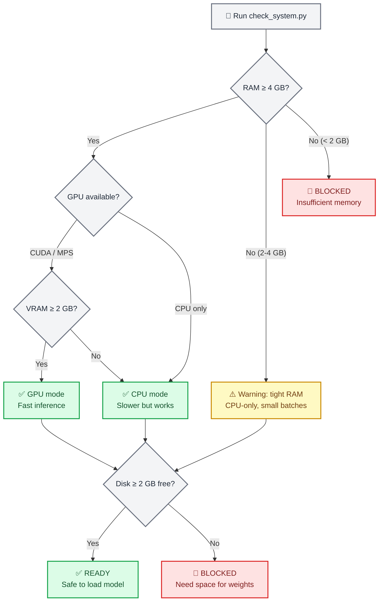
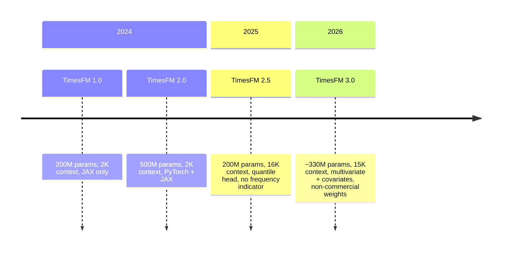

# TimesFM Forecasting

## Overview

TimesFM (Time Series Foundation Model) is a pretrained decoder-only foundation model
developed by Google Research for time-series forecasting. It works **zero-shot** — feed it
a time series and it returns point forecasts with quantile prediction intervals, no
training required. The `timesfm` package (current 3.0.2) ships two model APIs:

- **TimesFM 2.5** (200M, Apache-2.0 weights) — `timesfm.TimesFM_2p5_200M_torch` with
  `ForecastConfig`; univariate, optional covariates via XReg. The default in this skill and
  the only choice for commercial or production use.
- **TimesFM 3.0** (~330M, released Aug 2026) — `timesfm3.TimesFM3Forecaster`; univariate
  *and* multivariate forecasting with native past-only and past-and-future covariates.
  Its weights are under `timesfm-non-commercial-license-v1.0`, so use it only for
  non-commercial research and tell the user about the restriction.

This skill wraps TimesFM for safe, agent-friendly local inference. It includes a
**mandatory preflight system checker** that verifies RAM, GPU memory, and disk space
before the model is ever loaded so the agent never crashes a user's machine.

> **Key numbers**: TimesFM 2.5 uses 200M parameters (0.93 GB safetensors); TimesFM 3.0 uses
> ~330M (1.3 GB). Run the system checker before the first load so an under-resourced machine
> fails fast instead of swapping or crashing.

## When to Use This Skill

Use this skill when:

- Forecasting **any univariate time series** (sales, demand, sensor, vitals, price, weather)
- You need **zero-shot forecasting** without training a custom model
- You want **probabilistic forecasts** with calibrated prediction intervals (quantiles)
- You have time series of **any length** (the model handles 1–16,384 context points)
- You need to **batch-forecast** hundreds or thousands of series efficiently
- You want a **foundation model** approach instead of hand-tuning ARIMA/ETS parameters
- You have **related channels or known future drivers** (TimesFM 3.0 multivariate + covariates, or TimesFM 2.5 XReg)

### Does NOT Trigger

| Scenario | Use Instead |
|----------|-------------|
| Classical models with interpretable coefficients (ARIMA/SARIMAX tables), VAR, or Granger causality tests | `alterlab-statsmodels` |
| Time-series classification, clustering, segmentation, or similarity search | `alterlab-aeon` |
| Exploring a time-series file's structure and quality before any forecasting | `alterlab-eda` |
| Tabular (non-temporal) prediction | `alterlab-scikit-learn` |

> **Note on Anomaly Detection**: TimesFM does not have built-in anomaly detection, but you can
> use the **quantile forecasts as prediction intervals** — values outside the 80% CI (q10–q90)
> are statistically unusual. See the `examples/anomaly-detection/` directory for a full example.

## Preflight: System Requirements Check

Run the system checker before loading a model for the first time on a machine: loading
downloads ~1 GB of weights and allocates several GB of RAM, and the checker stops early with
a clear message instead of letting the load crash or swap.

```bash
python scripts/check_system.py
```

This script checks:

1. **Available RAM** — warns if below 4 GB, blocks if below 2 GB
2. **GPU availability** — detects CUDA/MPS devices and VRAM
3. **Disk space** — verifies room for the ~800 MB model download
4. **Python version** — requires 3.10+
5. **Existing installation** — checks if `timesfm` and `torch` are installed

> **Note:** Model weights are **NOT stored in this repository**. TimesFM weights (~800 MB)
> download on-demand from HuggingFace on first use and cache in `~/.cache/huggingface/`.
> The preflight checker ensures sufficient resources before any download begins.



### Hardware Requirements by Model Version

| Model | Parameters | RAM (CPU) | VRAM (GPU) | Disk | Context |
| ----- | ---------- | --------- | ---------- | ---- | ------- |
| TimesFM 3.0 (non-commercial weights) | ~330M | ≥ 6 GB | ≥ 4 GB | ~1.3 GB | up to 15,360 |
| **TimesFM 2.5** (default) | 200M | ≥ 4 GB | ≥ 2 GB | ~0.9 GB | up to 16,384 |
| TimesFM 2.0 (archived) | 500M | ≥ 16 GB | ≥ 8 GB | ~2 GB | up to 2,048 |
| TimesFM 1.0 (archived) | 200M | ≥ 8 GB | ≥ 4 GB | ~800 MB | up to 2,048 |

> **Recommendation**: Use TimesFM 2.5 by default (smallest, Apache-2.0, full `ForecastConfig`
> control). Use TimesFM 3.0 for multivariate targets or native covariates when the
> non-commercial license fits the project. The 1.0/2.0 checkpoints need `timesfm==1.3.0`
> and are only worth it for reproducing old results. Measured peak CPU memory for 32 series ×
> 1,024 context (timesfm 3.0.2): ~2.0 GB for 2.5 and ~2.7 GB for 3.0; the thresholds above
> leave headroom. Check 3.0 with `python scripts/check_system.py --model v3.0`.

## 🔧 Installation

### Step 1: Verify System (always first)

```bash
python scripts/check_system.py
```

### Step 2: Install TimesFM

```bash
uv pip install "timesfm[torch]"          # TimesFM 2.5 + 3.0, PyTorch backend
uv pip install "timesfm[torch,xreg]"     # + XReg covariates for TimesFM 2.5 (adds JAX, scikit-learn)
uv pip install "timesfm[mlx]"            # TimesFM 3.0 on Apple silicon without PyTorch
uv pip install "timesfm[flax]"           # TimesFM 2.5 JAX/Flax backend
```

### Step 3: Install PyTorch for Your Hardware

```bash
# CPU-only wheels (small download, no CUDA libraries)
uv pip install torch --index-url https://download.pytorch.org/whl/cpu

# NVIDIA GPU: take the CUDA-specific index URL from https://pytorch.org/get-started/locally/
# Apple Silicon: the default PyPI wheel already includes MPS support
uv pip install torch
```

### Step 4: Verify Installation

```python
from importlib.metadata import version
import timesfm  # noqa: F401  (import check)
print(f"TimesFM version: {version('timesfm')}")  # the package defines no __version__
print("Installation OK")
```

## 🎯 Quick Start

### Minimal Example (5 Lines)

```python
import torch, numpy as np, timesfm

torch.set_float32_matmul_precision("high")

model = timesfm.TimesFM_2p5_200M_torch.from_pretrained(
    "google/timesfm-2.5-200m-pytorch"
)
model.compile(timesfm.ForecastConfig(
    max_context=1024, max_horizon=256, normalize_inputs=True,
    use_continuous_quantile_head=True, force_flip_invariance=True,
    infer_is_positive=True, fix_quantile_crossing=True,
))

point, quantiles = model.forecast(horizon=24, inputs=[
    np.sin(np.linspace(0, 20, 200)),  # any 1-D array
])
# point.shape == (1, 24)        — median forecast
# quantiles.shape == (1, 24, 10) — 10th–90th percentile bands
```

### TimesFM 3.0 (multivariate, native covariates)

```python
import numpy as np
from timesfm3 import TimesFM3Forecaster  # non-commercial weights — see license note above

forecaster = TimesFM3Forecaster.from_pretrained("google/timesfm-3.0-pytorch", device="cpu")  # or "cuda"

out = forecaster.predict(np.sin(np.linspace(0, 40, 512)).astype(np.float32),
                         horizon=24, return_quantiles=True)
# out.forecast.shape == (24,)      — median forecast
# out.quantiles.shape == (24, 9)   — q10..q90; index 4 is the median (no mean column)

# Two target channels plus one known-future covariate (context 256, horizon 32)
target = np.stack([np.sin(np.linspace(0, 24, 256)), np.cos(np.linspace(0, 24, 256))]).astype(np.float32)
future_cov = np.sin(np.linspace(0, 30, 256 + 32))[None, :].astype(np.float32)
out = forecaster.predict(target, horizon=32, past_future_covariates=future_cov, return_quantiles=True)
# out.forecast.shape == (2, 32); out.quantiles.shape == (2, 32, 9)
```

Full parameter list (`predict_batch`, `past_only_covariates`, `make_positive`, …):
`references/api_reference.md`.

### Forecast from CSV

```python
import pandas as pd, numpy as np

df = pd.read_csv("monthly_sales.csv", parse_dates=["date"], index_col="date")

# Convert each column to a list of arrays
inputs = [df[col].dropna().values.astype(np.float32) for col in df.columns]

point, quantiles = model.forecast(horizon=12, inputs=inputs)

# Build a results DataFrame
for i, col in enumerate(df.columns):
    last_date = df[col].dropna().index[-1]
    future_dates = pd.date_range(last_date, periods=13, freq="MS")[1:]
    forecast_df = pd.DataFrame({
        "date": future_dates,
        "forecast": point[i],
        "lower_80": quantiles[i, :, 1],  # q10 — lower bound of 80% PI
        "upper_80": quantiles[i, :, 9],  # q90 — upper bound of 80% PI
    })
    print(f"\n--- {col} ---")
    print(forecast_df.to_string(index=False))
```

### Forecast with Covariates (XReg)

TimesFM 2.5 supports exogenous variables through `forecast_with_covariates()`. It requires
`timesfm[xreg]` and a model compiled with `return_backcast=True` (otherwise it raises
`ValueError`). TimesFM 3.0 takes covariates directly in `predict()` (see above).

```python
# Requires: uv pip install "timesfm[torch,xreg]"
model.compile(timesfm.ForecastConfig(
    max_context=1024, max_horizon=256, normalize_inputs=True,
    use_continuous_quantile_head=True, fix_quantile_crossing=True,
    return_backcast=True,
))
point, quantiles = model.forecast_with_covariates(
    inputs=inputs,
    dynamic_numerical_covariates={"price": price_arrays},
    dynamic_categorical_covariates={"holiday": holiday_arrays},
    static_categorical_covariates={"region": region_labels},
    xreg_mode="xreg + timesfm",  # or "timesfm + xreg"
)
# point / quantiles: one array per series — (horizon,) and (horizon, 10)
```

| Covariate Type | Description | Example |
| -------------- | ----------- | ------- |
| `dynamic_numerical` | Time-varying numeric | price, temperature, promotion spend |
| `dynamic_categorical` | Time-varying categorical | holiday flag, day of week |
| `static_numerical` | Per-series numeric | store size, account age |
| `static_categorical` | Per-series categorical | store type, region, product category |

**XReg Modes:**
- `"xreg + timesfm"` (default): fit an in-context linear regression on the covariates first, then TimesFM forecasts the regression residuals
- `"timesfm + xreg"`: TimesFM forecasts first, then a linear regression on the covariates fits TimesFM's residuals

> See `examples/covariates-forecasting/` for a complete example with synthetic retail data.

### Anomaly Detection (via Quantile Intervals)

TimesFM does not have built-in anomaly detection, but the **quantile forecasts naturally provide
prediction intervals** that can detect anomalies:

```python
point, q = model.forecast(horizon=H, inputs=[values])

# 80% prediction interval
lower_80 = q[0, :, 1]  # 10th percentile
upper_80 = q[0, :, 9]  # 90th percentile

# Detect anomalies: values outside the 80% CI
actual = test_values  # your holdout data
anomalies = (actual < lower_80) | (actual > upper_80)

# Severity levels
is_warning = (actual < q[0, :, 2]) | (actual > q[0, :, 8])  # outside 60% CI
is_critical = anomalies  # outside 80% CI
```

| Severity | Condition | Interpretation |
| -------- | --------- | -------------- |
| **Normal** | Inside 60% CI | Expected behavior |
| **Warning** | Outside 60% CI | Unusual but possible |
| **Critical** | Outside 80% CI | Statistically rare (< 20% probability) |

> See `examples/anomaly-detection/` for a complete example with visualization.

## 📊 Output, Config & Workflows

The output structure and full `ForecastConfig` reference are in
**[`references/output_and_config.md`](references/output_and_config.md)**.

> **Quantile layout (TimesFM 2.5):** `quantile_forecast` has shape `(batch, horizon, 10)`.
> Index 0 is the **mean**; q10 = index 1, q50 (median) = index 5, q90 = index 9, so the 80% PI
> is `q[:,:,1]`–`q[:,:,9]`. **TimesFM 3.0** returns 9 columns (q10–q90) with the median at
> index 4 — re-check indices when switching models.

Copy-paste workflows (single-series, batch, accuracy evaluation), GPU/memory performance
tuning, and integration with `statsmodels` / `matplotlib` / EDA are in
**[`references/workflows.md`](references/workflows.md)**.


## 📚 Scripts

- **`scripts/check_system.py`** — mandatory preflight checker; run before first model load. Reports RAM/GPU/disk/Python/install status and a recommended `per_core_batch_size`.
- **`scripts/forecast_csv.py`** — end-to-end CSV forecasting with automatic system check:
  ```bash
  python scripts/forecast_csv.py input.csv --horizon 24 \
      --date-col date --value-cols sales,revenue --output forecasts.csv
  ```

## 📖 Reference Documentation

Detailed guides in `references/`:

| File | Contents |
| ---- | -------- |
| [`references/output_and_config.md`](references/output_and_config.md) | Output shapes, quantile index map, full `ForecastConfig` parameter reference |
| [`references/workflows.md`](references/workflows.md) | Single/batch/eval workflows, GPU & memory tuning, statsmodels/matplotlib/EDA integration |
| [`references/pitfalls_and_validation.md`](references/pitfalls_and_validation.md) | Common pitfalls, quality checklist, known mistakes, regression-baseline validation |
| [`references/system_requirements.md`](references/system_requirements.md) | Hardware tiers, GPU/CPU selection, memory estimation formulas |
| [`references/api_reference.md`](references/api_reference.md) | Full `from_pretrained` options, API surface, output shapes |
| [`references/data_preparation.md`](references/data_preparation.md) | Input formats, NaN handling, CSV loading, covariate setup |

> **Before declaring any task done**, run the quality checklist and review the common
> pitfalls/mistakes in [`references/pitfalls_and_validation.md`](references/pitfalls_and_validation.md)
> — especially the quantile index off-by-one and `infer_is_positive` for negative series.

## Model Versions



| Version | Params | Context | Quantile Head | Frequency Flag | Status |
| ------- | ------ | ------- | ------------- | -------------- | ------ |
| 3.0 | ~330M | 15,360 | ✅ 9 deciles | ❌ | Latest (non-commercial weights) |
| **2.5** | 200M | 16,384 | ✅ Continuous (30M) | ❌ Removed | Default (Apache-2.0) |
| 2.0 | 500M | 2,048 | ✅ Fixed buckets | ✅ Required | Archived |
| 1.0 | 200M | 2,048 | ✅ Fixed buckets | ✅ Required | Archived |

**Hugging Face checkpoints:**

- `google/timesfm-3.0-pytorch` (TimesFM 3.0; non-commercial license)
- `google/timesfm-2.5-200m-pytorch` (default)
- `google/timesfm-2.5-200m-flax`
- `google/timesfm-2.5-200m-transformers` (🤗 Transformers port, `TimesFm2_5ModelForPrediction`)
- `google/timesfm-2.0-500m-pytorch` (archived)
- `google/timesfm-1.0-200m-pytorch` (archived)

## Resources

- **Paper**: [A Decoder-Only Foundation Model for Time-Series Forecasting](https://arxiv.org/abs/2310.10688) (ICML 2024)
- **Repository**: https://github.com/google-research/timesfm
- **Hugging Face**: https://huggingface.co/collections/google/timesfm-release-66e4be5fdb56e960c1e482a6
- **Google Blog**: https://research.google/blog/a-decoder-only-foundation-model-for-time-series-forecasting/
- **BigQuery Integration**: https://cloud.google.com/bigquery/docs/timesfm-model

## Examples

Three reference examples live in `examples/`; all use the TimesFM 2.5 API (outputs regenerated with timesfm 3.0.2 in 2026-09). Use them as ground truth for correct API usage and expected output shape.

| Example | Directory | What It Demonstrates | When To Use It |
| ------- | --------- | -------------------- | -------------- |
| **Global Temperature Forecast** | `examples/global-temperature/` | Basic `model.forecast()` call, CSV -> PNG -> GIF pipeline, 36-month NOAA context, 60%/80% prediction intervals | Starting point; copy-paste baseline for any univariate series |
| **Anomaly Detection** | `examples/anomaly-detection/` | Two-phase detection: linear detrend + Z-score on context, quantile PI on forecast; 2-panel viz | Any task requiring outlier detection on historical + forecasted data |
| **Covariates (XReg)** | `examples/covariates-forecasting/` | `forecast_with_covariates()` API (TimesFM 2.5), covariate decomposition, 2x2 shared-axis viz | Retail, energy, or any series with known exogenous drivers |

### Running the Examples

```bash
# Global temperature (TimesFM 2.5)
cd examples/global-temperature && python run_forecast.py && python visualize_forecast.py

# Anomaly detection (TimesFM 2.5)
cd examples/anomaly-detection && python detect_anomalies.py

# Covariates (data + API walkthrough; real inference needs timesfm[torch,xreg])
cd examples/covariates-forecasting && python demo_covariates.py
```

### Expected Outputs

| Example | Key output files | Acceptance criteria |
| ------- | ---------------- | ------------------- |
| global-temperature | `output/forecast_output.json`, `output/forecast_visualization.png` | `point_forecast` has 12 values; PNG shows context + forecast + PI bands |
| anomaly-detection | `output/anomaly_detection.json`, `output/anomaly_detection.png` | Sep 2023 flagged CRITICAL (z >= 3.0); >= 2 forecast CRITICAL from injected anomalies |
| covariates-forecasting | `output/sales_with_covariates.csv`, `output/covariates_data.png` | CSV has 108 rows (3 stores x 36 weeks); stores have **distinct** price arrays |

## Quality, Mistakes & Validation

Before declaring any task done, run the post-task **quality checklist**, review the
**known mistakes** (quantile off-by-one, covariate-horizon coverage, residual-based anomaly
detection, etc.), and run the **regression-baseline verification** snippets — all in
**[`references/pitfalls_and_validation.md`](references/pitfalls_and_validation.md)**.

Part of the AlterLab Academic Skills suite.

