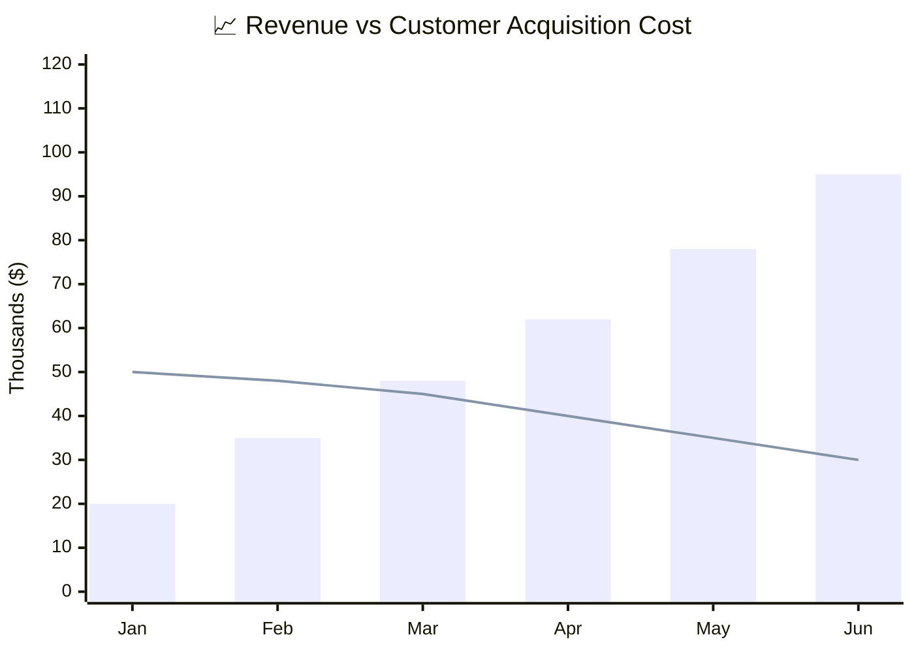
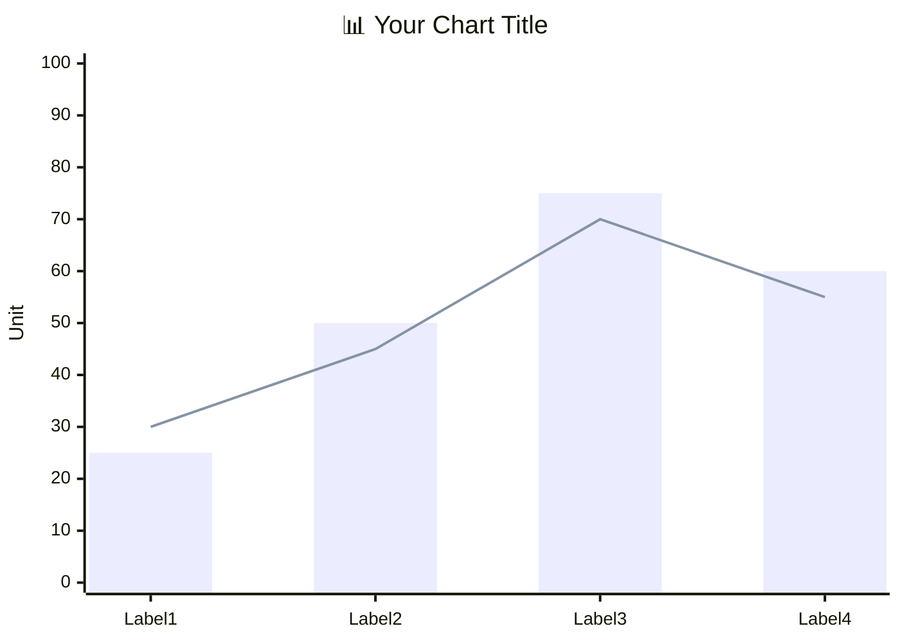

<!-- Source: https://github.com/SuperiorByteWorks-LLC/agent-project | License: Apache-2.0 | Author: Clayton Young / Superior Byte Works, LLC (Boreal Bytes) -->

# XY Chart

> **Back to [Style Guide](../mermaid_style_guide.md)** — Read the style guide first for emoji, color, and accessibility rules.

**Syntax keyword:** `xychart-beta`
**Best for:** Numeric data visualization, trends over time, bar/line comparisons, metric dashboards
**When NOT to use:** Proportional breakdowns (use [Pie](pie.md)), qualitative comparisons (use [Quadrant](quadrant.md))

> ✅ **Accessibility:** XY charts support `accTitle`/`accDescr` (checked on Mermaid 11.12, 11.17, and 12.0) — put them on the lines right after `xychart-beta`. An italic description paragraph above the block remains a useful fallback for readers of the raw Markdown.

---

## Exemplar Diagram

_XY chart comparing monthly revenue growth (bars) versus customer acquisition cost (line) over six months, showing improving unit economics as revenue rises while CAC steadily decreases:_

---

## Tips

- Combine `bar` and `line` to show different metrics on the same chart
- Use **emoji in the title** for visual flair: `"📈 Revenue Growth"`
- Use quoted `title` and axis labels
- Define axis range with `min --> max`
- Keep data points to **6–12** for readability
- Multiple `bar` or `line` entries create grouped series
- **Always** pair with a detailed Markdown text description above for screen readers

---

## Template

_Description of what the X axis, Y axis, bars, and lines represent and the key insight:_

